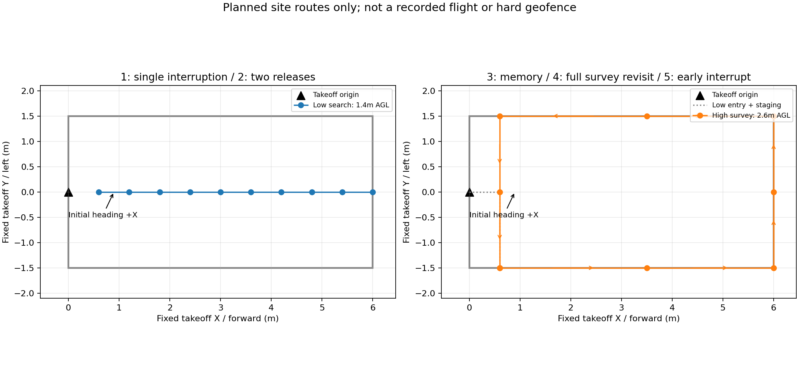

# 2026-09-28 现场五组渐进试飞准备

2026-09-29当前：[部署更新与bag-only说明](../../docs/deployment/board_refresh_20260929/README.md)。现场后续覆盖档为2m高位、30cm末端悬停、障碍柱关闭；下列9月28日初始准备参数保留为历史。

**当晚更新：用户选择实际舵机投递。以下现场快捷入口的1/2/4/5组flight已选择实投，3组无投递；详见文末。**

已按用户确认采用前方6m、左右±1.5m。使用本页入口时，低空直线、高位环线、任务目标范围、重访网格、规划搜索边界同步调整；没有只改航点而遗留旧4×4限制。原始八组仍保留4×4默认。

板端目录：`/home/orangepi/liftrace_board_trials_20260928`，SSH：`orangepi@192.168.43.59`。这次只准备01、05、07、02、06，不运行H降落、走廊降落和三投接走廊/H。

## 五组顺序

| 本页序号 | 原目录 | 建议布靶与检查重点 | 正常结束 |
|---|---|---|---|
| 1 | 01_visual_interrupt | 一个高权重靶放直线前方约2m；观察确认、中断、接近、对准和一次模拟释放 | 恢复后原地降落 |
| 2 | 05_low_multi | 两个不同类别高权重靶沿直线分开放置，例如前方2m与4m；观察投后恢复、第二次中断和槽位事务 | 两次模拟释放后降落 |
| 3 | 07_memory_only | 把1–3个高权重靶放在高位环线可见范围，先检查类别、坐标、同地去重和记忆 | 完整一圈后下降降落，无APPROACH/舵机调用 |
| 4 | 02_high_view_revisit | 先用1个靶，再用2–3个；完整高位环线后重访已记住的目标 | 重访/模拟投递结束，在最后目标处降落 |
| 5 | 06_high_priority | 三类bridge、panzer、red_cross；观察全部受支持线索形成时提前结束高位、低位复核和连续投递 | 已有高位专项收尾，不接走廊/H |

布靶位置只是现场建议，不作为任务目标真值输入。目标放在边界内并留机体/槽位余量；图是名义路线，实际仍由在线地图规划绕障。先解决本级问题再推进下一组。



## 参数与范围

- 固定起飞坐标：+X为初始机头前方，+Y为左侧；每轮从近侧边中点重新摆正、未解锁静置。
- 低空直线：X=0.6至6m、Y=0；高位环线：X=0.6至6m、Y=±1.5m，沿边分段。分段方便规划，不是预先给靶坐标。
- 入口(0.6,0)，高位环线9点；首次入场沿用低位入场后升高的现有时序。
- 中心规划/目标准入范围X∈[-0.35,6]、Y∈[-1.5,1.5]；负X为起飞参考缓冲。地图16×6×3.8m，避免6m终点被居中的旧10m地图截掉。
- 速度0.5m/s、加速度0.35m/s²；低空FC离地1.4m、高位2.6m、模拟投递0.60m。高度由已知机架/相机参数和地面静置参考自动生成，不手填ground_z。
- 静态map→camera_init、虚拟顶棚关闭、水平0.25m/上0.20m/下0.10m；FAST-LIO特征开启、局部地图20m、det_range=6m；高位三组使用当前中部障碍柱。
- 五分类FP16 RKNN及匹配metadata。单次有效投影且置信度≥0.60可形成粗线索，提前中断仍按共享策略的一致观测条件；未恢复panzer专用特判，未降低投递许可。
- 范围由[test_area.yaml](test_area.yaml)单点维护。边界是任务/规划范围，不是PX4硬围栏，CV修正与跟踪误差仍需场地余量。
- 槽位补偿保留公共known_rig，未把现场另一份符号相反的槽位表覆盖进去。模拟投递不验证真实槽位安装或落点。

## 启动

先按[设备说明](README.md)启动现场MAVROS、MID360 driver2和相机。旧整机应用与本入口不能同时运行。相机需有原始图、压缩图和CameraInfo。

第一组先预览：

```bash
cd ~/liftrace_board_trials_20260928
bash deployment/site_20260928/start_test.sh 1 preview
```

preview启动定位、地图、视觉与录制，没有控制输出。关闭preview后，需要现场飞行时：

```bash
bash deployment/site_20260928/start_test.sh 1 flight
```

flight接通控制输出，仍不自动解锁或开始航线。等待READY，按现场流程操作，确认低位悬停稳定后，在另一个已source终端启动任务：

```bash
cd ~/liftrace_board_trials_20260928
source deployment/site_20260928/environment.sh
rosservice call /navigation/start_mission "{}"
```

切换组别把序号1改为2、3、4、5。每轮落地后退出应用，把飞机摆回起飞点再开始下一轮。应用自动收尾要求经历IN_AIR后ON_GROUND且未解锁；已落地但未自动收尾时，由现场确认后Ctrl+C，保留日志，不强制上锁。

默认模拟投递，真实舵机不需要开启。另行准备实投时使用各目录原有start_real.sh，并显式追加 `--site-config "$PWD/deployment/site_20260928/test_area.yaml"`；本次没有触发实投或PWM。

## 自动录制

preview/flight均生成 `logs/board_<专项>_<时间>/`：

- 2026-09-29起相机仅录bag；保留轻量事件JSONL、轨迹CSV、任务结果和bag网页索引，板端移除独立MP4录制/转码。
- 新增flight_debug_*.bag：原分辨率压缩相机与CameraInfo、TF、定位、实际/规划/设定点轨迹、候选/精修/投影/记忆、任务状态、对准/许可/释放，以及FreeDOM/膨胀地图。不录原始Livox或未压缩大图。
- run_metadata.json及bag话题/board_trials/run_metadata保存专项、参数、部署revision、模型路径/大小/metadata、外参与地面参考；camera_info.json保存实际输入内参。
- bag_topics.json记录话题，bag_recording.json记录关闭状态、各话题条数和缺失项。其PASS仅表示录包基础检查通过，不表示任务通过。
- LZ4、512MiB分卷、128MiB缓冲，至少保留2GiB空闲；900秒或存储预算耗尽时只关闭录包并报告，不切换飞行模式。bag保留相机实际发布帧，板端不编码MP4。
- 收尾先让应用退出，再SIGINT正常关闭bag并检查索引；还有.bag.active时不要直接断电。入口要求压缩图新鲜，避免录包没有相机。

bag可交给现成tools/bag_replay工作流生成原相机、叠加、航迹动画和多画面报告。数据缺失保留INCOMPLETE，不补造候选或成功状态。

## 验证结果与限制

板端27项单元测试通过，原八组×preview/flight共16种展开通过；现场五组×两模式的10种配置范围/高度/模型/mock接线展开通过，五组实际入口--check-config通过。

板端独立localhost:11319实际录包自测通过：25张合成压缩图、25条CameraInfo、25条Pose、25条detections，静态TF和部署元数据均录入；索引和JPEG解码通过，无遗留.active。仅发布SELFTEST数据，不接入飞控/导航任务；未启动Gazebo、飞控、舵机或飞行。

产物在板端deployment_results/recording_selftest_205648/；静态检查在site_validation.json、preflight_after_site.log；摘要见[PREPARATION_CHECKS.json](PREPARATION_CHECKS.json)。

接线后eth0恢复，雷达192.168.1.175可达；相机原始/压缩图与CameraInfo、LIO均有新鲜输入，MAVROS连接且未解锁。第一组preview被现有航向初始化条件拦住：单位静态TF下/navigation/local_pose机头角约0.992rad（56.8°），超过起飞+X容限0.10rad；没有进入应用或飞行。LIO相对角度尚未完成核对，不能仅由此指定错误来源。用户正在重新摆正并重启，按用户要求等通知后再连接复核。此前high_view三投后落地位姿不连续INCOMPLETE仍待验证，不能宣称已修复；H/走廊本轮排除。

地面检查日志：deployment_results/ground_preview_210344；本轮应用目录logs/board_visual_interrupt_20260928_210541。重启前后的原始日志须保留，初始化中止而没有检测结果的bag应标记INCOMPLETE。


## 当晚现场实投选择（用户追加确认）

今天用户已明确要求有投递的专项使用真实舵机。本现场专用start_test.sh中，序号1/2/4/5的flight调用已有start_real.sh，经--real-release进入真实/legacy/Servo_raw；preview无控制输出，序号3仍只记忆不投递。八组原始settings默认mock不变，仿真仍使用mock。未绕过释放许可、证据新鲜度和槽位检查，也不在启动时发投递命令。

现场需要已有patrol_control/Servo类型的/legacy/Servo_raw服务；入口在启用飞行应用前检查服务，缺失则拒绝。真实驱动的启动方式与舵机供电要在重连后核对。此前“默认模拟投递”的说明只适用于八组原入口和本次静态/录制自测，不适用于当天这个现场flight快捷入口。

目前香橙派重启后断联，用户要求等待恢复；尚未开启flight或进行投递。首次preview的航向初始化问题仍待重启后复核。


## 重连后的实际执行记录
- 1da9c7f现场配置已同步至香橙派，部署manifest已更新。
- 用户授权启用舵机，复用现场init_pwm.sh与pwm_node1，仅将服务重映射到/legacy/Servo_raw。服务类型patrol_control/Servo已读回，三仓复位后enable全0，初始脉宽为700000/1000000/1100000。没有发送释放请求。
- 第一组尚未飞行：MAVROS connected=false、串口TX queue overflow；重连后状态话题也曾超时，随后SSH再次在banner握手超时。用户重新接线后最新SSH重试仍未登录，因此无法确认飞控是否恢复。
- 没有解锁、模式切换或任务开始调用。待连接恢复后继续第一组，不重复整套静态验收。


## 2026-09-29 新增第六项：高速采集

原五组次序不改；capture/6追加为只拍摄不投递专项，前6m/左右1.5m、2m高位、0.5与1m/s对照、30cm悬停结束。完整操作见[第09组](../board_trials_4x4/09_high_speed_capture/README.md)。该入口已于9月29日部署并通过板端构建/离线入口检查，尚未实飞。

2026-10-03更新：[第6组/第09模块新路线与速度](../board_trials_4x4/09_high_speed_capture/README.md)：沿第5组场内巡航点，默认正赛1.2m/s、1.0m/s²，2m高度，返起飞点30cm悬停；仅采集不投递。旧0.5/1m/s直线往返说明保留作历史。新版已离线检查，未部署或实飞。
