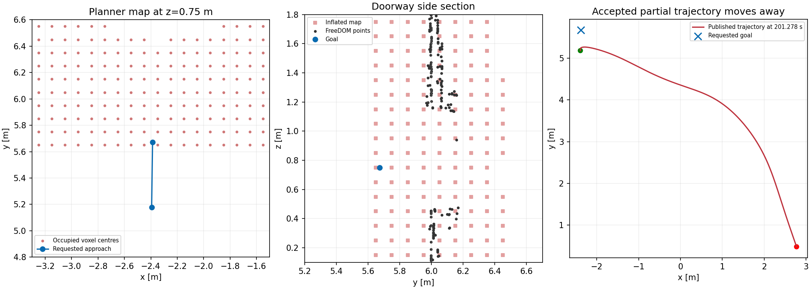

> 历史阶段记录。后续 R56 根因修复已完整 PASS（37/37）；最新结果见 [最终报告](../r56_final/REPORT.md)。本文件保留当次运行的真实结论。

# R54 门前失败根因与走廊模式方案

2026-09-07。仅使用 R54 既有 bag、日志、源码和 git 历史离线分析；未启动 ROS master、planner 回放或 SITL，未修改运行代码/参数。

## 结论

当前首要失败链条为：**门前目标格被门柱点云的膨胀占据 → 近目标搜索继续扩展并接受无目标进展的 7 m 局部轨迹 → 长时间同步搜索阻塞地图/位姿回调，重规划期间旧轨迹继续执行 → 90 秒动作期限耗尽。**

R54 的三投和前三个走廊入口引导段均已完成。后续失败不是靠再加一两个低位点就能解决的；可以采用阶段切换，但应切换实际规划策略和门洞地图精度，而不是只增加任务状态名称。

## 1. 当时目标格不可达

R54 复跑 `r2026_integrated_r54_guided_entry_20260907_025104` 的 goal 19 为 `(-2.386703, 5.672270, 0.75)`。发出前的 164.685 s 膨胀地图中：

- 起点 `(-2.393654, 5.178551, 0.796951)` 所在格为空闲；目标格已占据。
- 直线约到 y=5.6007 m 时进入占据格。门洞中心 `(-2.386703, 6.072270, 0.75)` 也被占据。
- 201.344 s、202.451 s 后续地图仍占据该目标；0.55–1.45 m、每 0.1 m 的中心线高度采样均占据。不能把简单升回 0.9 m 当作已验证解决方案。
- 当时 FreeDOM 点云中，5 个右门柱点能经当前膨胀进入目标格。一个代表点为 `(-2.002342, 5.969030, 0.760008)`。偏移 (-0.3,-0.3,0) 后落入 x=[-2.4,-2.3)、y=[5.6,5.7)、z=[0.7,0.8) 的格；目标恰在该格内。
- 对该目标格，搜索区竖向障碍列贡献为 0。关闭水平绕树规则本身不能消除这里的门柱膨胀。

栅格查询按 C++ 的 `floor((p-origin)/resolution)` 重建，origin=(-10,-10,-0.2)、resolution=0.1，使用发布的占据格中心恢复整数索引；没有采用会把格边界误判为空闲的点间距离近似。

这里确认的是当前指定目标及门洞中心通路被地图占据，不将有限采样扩展成“所有可能姿态/路径都无法过门”的结论。

## 2. 规划器返回了背离目标的局部轨迹

goal 19 在 164.691 s 发出，日志记录该次搜索耗时 36.529 ROS 秒。201.278 s 发布的 traj 19：

| 指标 | 实测 |
|---|---|
| 起点 | (-2.393629, 5.181346, 0.796283) |
| 终点 | (2.774424, 0.482078, 0.742383) |
| 起终点距离 | 6.985 m |
| 终点距任务目标 | 7.320 m |
| 曲线全程距目标最近距离 | 0.413 m |
| 曲线弧长 | 7.672 m |

运行参数 `search/horizon=7.0`；对应日志优化项含 `endpt`，源码仅在未 REACH_END 时加入此项。结合当前搜索只返回 REACH_END、REACH_HORIZON、NO_PATH，可确认这次进入的是 REACH_HORIZON 的局部路径分支。

`fbaf58b` 将“near_end 连接失败即 NEAR_END/NO_PATH”改为继续扩展。它解决了近目标绕树被提前终止的问题，但当前 `REACH_HORIZON` 只按离起点达到 7 m 判定；manager 接收任何非 NO_PATH 的曲线，没有检查局部终点是否推进门洞任务。目标格被占据时，这就允许返回朝场地另一侧延伸的曲线。

因此飞机的大范围绕行已存在于发布的规划轨迹中，不能只归因于飞控跟踪侧偏。轨迹净空检查通过也不等于任务取得进展。

## 3. 同步搜索阻塞了 planner 自身更新

| 话题 | R54 159–237 s 窗口内的最大相邻间隔 |
|---|---|
| `/sdf_map/occupancy_inflate` | 164.685→201.344，36.659 s；第二次 202.546→236.410，33.864 s |
| `/freedom/static_pointcloud` | 0.205 s |
| `/mavros/local_position/pose` | 0.062 s |

`fast_planner_node.cpp` 使用单线程 `ros::spin()`，搜索同步运行在 FSM 回调中，没有单次计算截止/分片。地图发布停顿与搜索时长一致，而上游点云和位姿持续更新，说明并非整条雷达/飞控通信停止。

普通重规划保留旧轨迹执行，是此前稳定跟踪修复的一部分。但第二次搜索耗时约 33.8 s，236.328 s 返回的新轨迹起点仍是 (-2.201,5.233,0.756)，此时实测飞机已经接近 (2.768,0.492,0.784)，相距约 6.9 m。这是同步计算与继续飞行组合下的状态陈旧问题。

首次未起飞的 startup_wall_timeout 属于另一条启动问题，不能与上述飞行中确定性的规划行为混为硬件故障。

## 4. 相比旧成功版，planner 改过什么

旧整场成功组合是导航 `3557215` + 视觉 `8e53bd0`（r41，9/9 路线、三门、H、自主降落）；r33 的 8/8 记录同样采用 Planner Bridge→Fast-Planner→patrol_control，不是另一个直飞执行器。r41 完整结构化目录目前缺失，只能结合现存报告/部分 ROS 日志与 git 源码，不声称已重新跑通旧版本。

| 导航提交 | 影响 |
|---|---|
| `d883b73` | 将按时间推进改为按实测位姿投影进度；改变重规划触发和起始速度；普通重规划继续旧安全轨迹；增加低空地图和完整曲线检查 |
| `957dd37` | 限制回弯前视弧长、固定样条边界、统一缩放时间，避免端点偏移和切到回弯另一端 |
| `fbaf58b` | 近目标短连接失败后继续扩展；更严格的边界/碰撞采样；当前大范围 horizon 路径放行与此改动直接相关 |
| `987b57c` | 加密运动原语碰撞检查；优化后若不安全，保留经过相同检查的初始拟合曲线 |
| `085548a` / 整机 `8dbc6da` | R54 本轮仅修改航点；复跑继续使用以上 planner 版本，未回退到 r41 |

另有配置变化：r41 横向膨胀 0.20 m、向上 0.20 m/向下 0.10 m（3557215 的 patrol_planner_sim.xml 第 69–70 行）、门前/门后 0.90 m、高空过渡 2.20 m、控制命令距离限制 0.20 m；当前分别为 0.30 m、0.75 m、1.40 m 分段降高、0.40 m。当前还使用正装机顶 MID360、相机低于 IMU 21 cm、飞控 IMU/气压计高度融合，不能把旧场景 PASS 直接移到新组合。

## 5. 推荐的状态切换方案

现有 MissionCore 已有 POST_DELIVERY_ROUTE，并逐段发出 RETURN_HOME；它目前只换航点，不切换 planner 策略。建议在这条现有链内加入走廊执行模式，保持一个 planner 和一个 setpoint 出口：

1. **搜索阶段**保留当前水平绕树和视觉三投链。走廊阶段复用旧成功链的中心线、门前/门后括点、沿门法向接近和门后再转弯的顺序；按当前机架确定高度，不恢复 2.2 m 搜索/高空跨障行为。
2. **先修正门洞表示。** 当前护圈网格顶点 x/y 范围为 ±0.30 m，简单把膨胀退回 0.20 m 会缩小机体包络。优先在走廊局部采用更细地图/精确包络检查，保留实际护圈余量，避免 10 cm 栅格把剩余净空吞掉。
3. **穿门采用完整、可通行的短段。** 对门前到门后的短距离请求，不把达到 7 m horizon 的无进展路径当作可执行替代；若不能找到通道，留在门外处理地图/对正问题。已有完整安全轨迹时稳定跟随，有真实阻挡或明显跟踪问题才重规划。
4. **让搜索不阻塞控制更新。** 搜索应分片或具备单次计算预算，使地图/位姿回调能继续工作；返回轨迹必须能从当前位姿衔接。不能仅延长任务的 90 秒期限。
5. **降落直接复用现有 H→AUTO.LAND→ON_GROUND→disarm 链。** 本次失败尚未进入降落阶段，没有依据改动降落逻辑。

不建议整套回退 planner：旧 traj_server 会在没有近邻轨迹点时直接退到远端终点，旧拟合与重分配也存在已修复的几何变化。应保留这些修复，只在走廊模式恢复适合短门段的搜索和执行行为。

## 6. 方案的离线支持与限度

使用 164.685 s 的同一 FreeDOM 点云重建局部门洞占据（不启动 planner）：

| 重建方式 | 0.75 m 门前点/门心点 | 0.90 m 门心点 |
|---|---|---|
| 当前 10 cm 格，横向 30 cm、向上 10 cm/向下 30 cm | 均占据 | 占据 |
| 5 cm 格，其余包络完全不变 | 均空闲 | 占据 |
| 旧横向 20 cm，当前垂向 | 均空闲 | 占据 |
| r41 实际：横向 20 cm、向上 20 cm/向下 10 cm | 均空闲 | 空闲 |

这说明“保留当前包络、提高走廊地图精度”有具体依据；旧版较小的占据膨胀也确实能打开这些查询点，是旧成功与当前结果不同的重要配置因素。这里使用的是 r41 实际的非对称垂向参数，已更正初稿误按对称 20 cm 建模的对比项。上述只检查有限位置的占据，未覆盖持续地图缓冲、完整 ESDF、动态姿态和实体碰撞，不是穿门 PASS；也不能把旧占据膨胀值脱离旧版净空检查和当前机架单独照搬。

结构化结果见 rootcause/analysis.json、extraction.json、geometry_comparison.json 和 splines.json。原始 bag 仍在 R54 发布归档，补充分析包包含提取脚本及点云快照。本次只提交诊断和方案，没有应用运行修复或再次测试。
