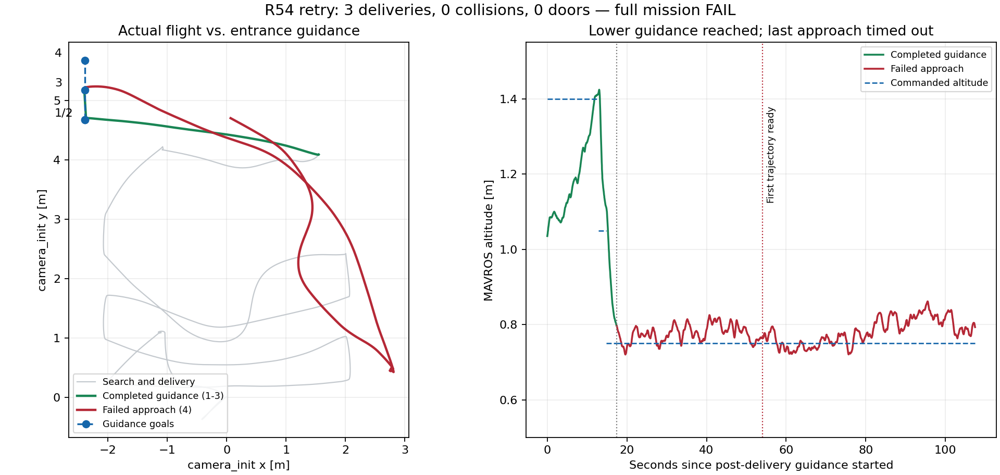

> 历史阶段记录。后续 R56 根因修复已完整 PASS（37/37）；最新结果见 [最终报告](../r56_final/REPORT.md)。本文件保留当次运行的真实结论。

# R54 航点适配与同轮复跑收尾

本次复跑完成三投和前三个门外引导航段，第一门前点仍因规划绕行、90 秒期限耗尽而失败。**整场 FAIL，未过门、未自主降落；main 未合并。**

## 轮次与来源

按用户追加的“重跑，可能是硬件问题，不新开轮数”，保留首次启动失败及一次原配置复跑，两次启动均归 R54；只有复跑进入实际飞行。未改变代码、参数、seed、计时阈值或运行入口。

| 记录 | 运行目录 | 结果 |
|---|---|---|
| 首次启动 | `r2026_integrated_r54_guided_entry_20260907_023929` | 180 秒启动期限耗尽，未解锁/起飞，startup_wall_timeout |
| 用户授权复跑 | `r2026_integrated_r54_guided_entry_20260907_025104` | 三投及恢复 3/3，前三个引导段完成；第 4 段超时，manager_failed / manager_aborted |

复跑 manifest 的实际源提交为 `19c602d`；航点配置来自整机分支 `8dbc6da`、导航分支 `085548a`。首次与复跑的源差异仅为首次收尾文档，运行代码和配置相同。原有 feature 分支保留。

## 航点修改与实测

参考旧成功实现 `3557215` 的门洞中心线与前后引导坐标，适配当前高度：保留 1.4 m 门外过渡点，在原位置分段降至 1.05 m，再向前 0.5 m 降至 0.75 m；保留原门前坐标，门后清空点再向北延伸 0.2 m 后爬升。路线由 9 段改为 11 段，门洞评分索引为 5/8/10。详细方案见 [PLAN](PLAN.md)。

| 引导航段 | 目标 camera_init 坐标 / m | 实测 |
|---|---|---|
| 1 | (-2.386703, 4.672270, 1.40) | 完成；ROS 147.253 → 160.184 s |
| 2 | (-2.386703, 4.672270, 1.05) | 完成；ROS 160.184 → 162.093 s |
| 3 | (-2.386703, 5.172270, 0.75) | 完成；ROS 162.093 → 164.691 s |
| 4 | (-2.386703, 5.672270, 0.75) | 未到达；164.691 s 发出，201.293 s 首条轨迹就绪，254.693 s 记录 decision_deadline_reached |

前三段合计约 17.4 ROS 秒。第 4 段在约 36.6 秒后才给出首条轨迹，随后飞向较远的搜索区域并重新规划，耗尽原有 90 秒期限。仅修改入口航点，能够完成门外降高，但本次未消除最后约 0.5 m 接近过程的搜路和绕行问题；门后延伸点尚未执行，不能评估其效果。既有地图曾显示门洞附近被膨胀占据，但此次未继续做根因修复或追加测试。

## 全量任务结果

- panzer、bridge、red_cross 三次投递提交，三次投递后恢复，均为 3/3；仅指本轮仿真，不等于连续稳定性验收。
- 碰撞 0、越界 0、超高 0，真值监测实体最高约 1.712 m；门洞穿越 0，未进入 H 降落阶段。
- 自动起飞成功；Gate 终止时飞控仍处于解锁/OFFBOARD，随后由统一仿真包装器结束整套 SITL。**清理成功不等于自主降落成功。**
- Gate 总状态 FAIL。`bridge_live_and_healthy`、单一 planner goal 发布者、无 unmatched result 为真；Gate 的 `contract_errors_zero` 为假，对应错误列表是 manager_failed、manager_aborted，不将其改写为接口全量 PASS。
- `mission_ros_sec` 等未完成任务指标为空，保留原始值，不用结束时刻冒充成功任务耗时。

## 启动问题与记录更正

复跑前没有 ROS/Gazebo/PX4 残留；WSL 约 14 GiB 内存可用、磁盘空间充足，宿主接通电源且处于 Turbo 模式，GPU 约 42°C。相同配置复跑可起飞，但这些观察不足以确定首次超时是硬件故障。

首次 bag 未录制 `/clock`，此前摘要的 `0.000 s` 来自提取器初始值，并非真实仿真时钟；现改为空值并注明缺失，另记录 run.log 最后带 ROS 时间戳为 6.178 s。首次失败原始 Gate、manifest 和日志继续保留。

首次正式启动前的预检查曾因 Windows→WSL 引号解析错误误起空 gzserver，已立即统一清理，未启动 PX4 或飞行任务；该说明保留，不将其计作飞行测试通过。

## 拓扑和产物

本轮从运行中的 ROS 网络调用 `rqt_graph` 后端 `NODE_NODE_GRAPH` 导出 Nodes only 图。椭圆为节点，边上的文字为 ROS 话题，箭头沿发布到订阅方向。

- [整机核心拓扑 SVG](topology/rqt_graph_nodes_only_core.svg)（29 个核心节点，按实际话题过滤）。
- [完整运行拓扑 SVG](topology/rqt_graph_nodes_only_full.svg)，包含评估、监视和仿真节点。
- 同目录保留 DOT、原始 ROS 系统状态和渲染结果；完整 PNG 见原始归档。
- 当前目录顶层 Gate、manifest、清理输出均对应复跑；首次记录在 `attempts/startup_timeout/`。两次启动的汇总为 [r54_retry_facts.json](r54_retry_facts.json)。
- 原失败/中断全量Release已于2026-09-08按清理要求退役；本目录历史报告和Git标签保留，小报告附件已留存于WSL。清理清单见[记录](../r60_full_matrix/release_cleanup.json)。

两次正式启动均通过统一包装器收尾并确认零残留。本次复跑后只做离线提取、文档和推送，未继续修改算法或重启仿真。main 保持原验收基线；本任务至此收口。

后续只读分析：[门前失败根因与走廊模式方案](DIAGNOSIS.md)。本轮运行结果保持 FAIL，未追加实跑。
