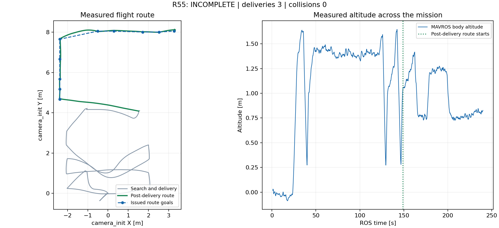

> 历史阶段记录。后续 R56 根因修复已完整 PASS（37/37）；最新结果见 [最终报告](../r56_final/REPORT.md)。本文件保留当次运行的真实结论。

# R55：三投、三门完成，降落阶段存储中断

**整场状态 INCOMPLETE，不是 PASS。** 本轮按授权只启动了一次。三投、11 段引导和三门穿越已完成，碰撞 0；可恢复数据截止时仍为 LAND / OFFBOARD，没有 AUTO.LAND、落地或最终 Gate 通过记录。main 保持原验收基线。

## 规划修复的实跑结果

实际运行提交 `fe9e720`，导航来源 `ef9f67f`。5 cm 地图保留 0.30 m 水平膨胀，短目标要求完整路径、搜索加入墙钟预算；修复说明及 7/7 离线检查见 [FIX](FIX.md)。继续复用现有 POST_DELIVERY_ROUTE 状态机、Fast-Planner 和原执行链。

- 三次投递提交：panzer, bridge, red_cross；最终槽位为 3/3。
- 11 段门外降高、对正、穿门、清出、H 点引导全部完成，202.735 ROS 秒接受 LAND，202.760 秒 H 检测阶段激活。
- 同一个门前 goal 19：R54 首条轨迹等待约 36.6 s；R55 为 **0.203 s**。整轮已记录膨胀地图最大消息间隔 0.549 s，飞行阶段最大为 0.365 s，没有复现几十秒建图阻塞。
- 第一门完整穿越目标 goal 20 曾因曲线净空被拒绝，下一次有效地图后约 1.833 s 生成可执行轨迹，随后通过；没有通过放宽净空检查来完成。
- 使用原 Gate reducer 对已恢复 pose 与任务阶段作离线过门检查：Wall_15 → Wall_20 → Wall_22 顺序完成，检查错误为空。此为恢复后的专项事实，不补造丢失的整场 Gate。

| 门 | 航段索引 | 过门横向坐标 / m | MAVROS 机体高度 / m |
|---|---:|---:|---:|
| Wall_15 | 5 | -2.36397 | 0.77812 |
| Wall_20 | 8 | 8.06054 | 1.24972 |
| Wall_22 | 10 | 8.01135 | 1.22397 |

碰撞监视器累计 12,352 帧、碰撞 0。Gazebo 机体原点最高 1.752 m；此数值不是保护圈最高点。H 等待期间 Gazebo 机体高度约 0.803–0.956 m。相机仍在雷达 IMU 正下方 21 cm；搜索 1.4 m、投递取景 1.6 m、未做槽位补偿。

## 中断及数据范围

运行目录为 `logs/r2026_integrated_r55_bounded_corridor_20260907_040048`。WSL 的 VHDX 位于宿主 F 盘；故障时 F 盘只剩约 17 MB，而 ext4 内部仍显示约 818 GB。之后 shell、日志读取和监视程序出现 I/O / Bus error，正常收尾脚本也无法创建进程。最终终止 Ubuntu 20.04，重启只用于离线恢复，确认 ROS/Gazebo/PX4/RViz 零残留。

9 个已封口 bag 可读，末个约 554 MB 的 `.bag.active` 在 E 盘副本上完成 reindex。可恢复消息截止 **239.976 ROS 秒**；run.log 最后完整时间戳为 246.596 s，尾部有零填充。原始中断文件保留，恢复不等于把缺失数据补齐。包装器未完成正常 trap，最终 `gate_status.json` 没有生成，不把强制停止写成自主降落或正常收尾 PASS。

## H 降落的剩余问题与记录修复

202.760 s 起 H 节点已激活；后续恢复到的 695 条 detections_mapped 消息没有 landing_pad。截止最后状态仍解锁 / OFFBOARD。H 等待早于最终存储崩溃，不能把未完成降落全部归因于硬件。

本轮实时 ROS 图显示原记录器订阅的 `/downward_camera/image_raw/compressed` 没有发布者，bag 确实没有 Image/CompressedImage；因此不能从本轮画面确认裁切、像素半径阈值或 H 结构判别是哪一项造成漏检。低空画面裁切及 300 px 半径上限是需验证的候选原因，并非已证实根因。

中断后只修复了记录入口：记录参数化真实原始相机话题、原始检测和 planner goal；增加日志盘配置及 WSL 宿主盘余量检查。XML、shell 和容量分支离线检查通过；新记录配置未重新飞行，详见 [RECORDING_FIX](RECORDING_FIX.md)。没有擅自修改 H 高度或再开一轮。

## 清理与交付

依用户追加授权，清理了 47.69 GiB 的重复归档及过时失败轮次大日志；保留本轮 R55、R54 对照、历史成功/板端资料和小报告。清单为 [cleanup_inventory.json](cleanup_inventory.json)。这是 ext4 内删除的数据量，宿主 VHDX 不会据此自动等量缩小。

- [恢复摘要](r55_facts.json) 与 [恢复范围](recovery_manifest.json)。
- [rqt_graph Nodes only 核心 SVG](topology/rqt_graph_nodes_only_core.svg)：29 节点；椭圆为节点，边文字为 ROS 话题，箭头沿发布到订阅方向。
- [完整运行拓扑](topology/rqt_graph_nodes_only_full.svg)，同时提供 DOT、PNG 和实际 ROS 系统快照。
- 原失败/中断全量Release已于2026-09-08按清理要求退役；本目录历史报告和Git标签保留，小报告附件已留存于WSL。清理清单见[记录](../r60_full_matrix/release_cleanup.json)。

远端分卷、大小和下载链接见 [remote_assets.json](remote_assets.json)。

单轮实跑至此收口。修复及报告推送功能分支并保留分支；缺少自主降落与完整 Gate 验收，尚不合入 main。后续需在录图有效且宿主空间足够的条件下单独验证 H 降落。
