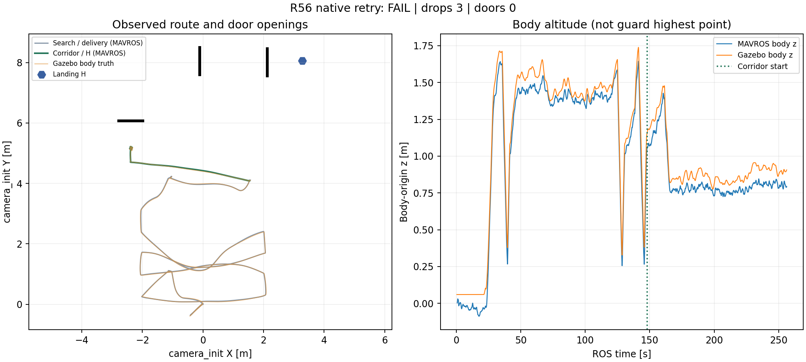
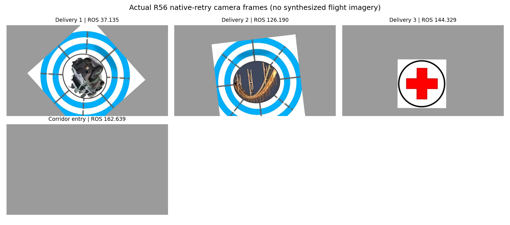
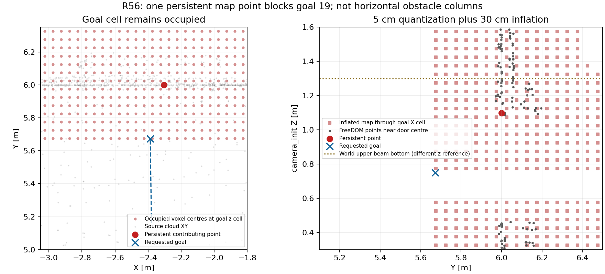

> 历史阶段记录。后续 R56 根因修复已完整 PASS（37/37）；最新结果见 [最终报告](../r56_final/REPORT.md)。本文件保留当次运行的真实结论。

# R4x—R56 整机修复、仿真与交付报告

日期：2026-09-07。R56 在用户明确要求后进行了同轮第二次运行，全部运行日志恢复到 WSL 项目内。本报告以最终 Gate、实际 bag、相机帧和参数读回为准。

**R56 同轮重跑结果：FAIL，原因 `manager_failed`。** 三次投递提交 3/3；三门记录 0/3；零碰撞判据 True；最终落地 False；最终 disarm False。

实际运行整机源码 `f0f748016064fbecabefd03d7b05503fb744a697`，导航修复 `4312488b66506e33464fde8a39a962428adff630`，main 集成准备源 `548dffcde60c626f4f7d906be94c7c562dc06932`。运行后的报告/绘图工具修正提交不冒充飞行源码。

- [Gate 原文](gate_status.json)、[飞行分析数值](r56_facts.json)、[任务事件](flight_events.json)、[运行 manifest](manifest.yaml)。
- [全部运行参数](rosparams.yaml)、[关键参数说明](PARAMETERS.md)、[PX4 8 项实际读回](px4_parameters_readback.json)。
- [实际航迹与高度](route_trace.png)、[相机关键帧](actual_camera_mission.png)。
- [rqt_graph Nodes only 阅读页](topology/index.html)、[主要链路 SVG](topology/rqt_graph_nodes_only_core.svg)、[全量 SVG](topology/rqt_graph_nodes_only_full.svg)。
- 依用户最新要求，失败轮次不发布全量 Release；本轮原始 run 保留在 WSL 本地用于定位，报告与小图表随功能分支提交。完整成功后再发布全量记录。

## 本轮飞行分析

本轮目录 `/home/xhj/liftrace-worktrees/r2026-competition-integrated/logs/r2026_integrated_r56_h_capture_native_retry_20260907_093916`。运行命令只在一次命令上设置 `SIM_RUN_AUTHORIZED=1`，使用统一 `run_competition_sim.sh`→`sim_run.sh`，`SIM_LOGS_DIR` 明确为项目 `logs/`，`SIM_STORAGE_GUARD_PATH=/mnt/f`。没有向 E 盘或其他盘写入此次日志，也没有新增仿真轮次。

| 项目 | 实际值 |
|---|---|
| 任务时长（ROS，离线首决策至 ABORT） | 228.069 s |
| 任务时长（墙钟，离线计算） | 1188.742 s |
| 仿真实时倍率（离线计算） | 0.192 |
| 投后成功航段 | 3 |
| H LAND 开始 | None ROS s |
| H 检测消息内条目 | 0（包含原始与映射输出，不是独立目标数） |
| 原始相机 Image | 4860 条 |
| CameraInfo | 4861 条 |
| 记录缓冲溢出警告 | 0 |
| Gazebo 机体原点最大记录 z | 1.7387103243811233 m |
| MAVROS 最大记录 z | 1.6444532871246338 m |
| wrapper 收尾 | PASS，精确进程名零残留 |

Gazebo 和 MAVROS 高度的原点/参考不同，数值不能直接当作护圈顶点高度；本报告明确标注机体原点，碰撞结论以接触传感器和 Gate 为准。

| 投递顺序 | 类别 | 槽位 | ROS 时间 |
|---|---|---|---|
| 1 | panzer | 1 | 39.666 s |
| 2 | bridge | 2 | 128.499 s |
| 3 | red_cross | 3 | 145.640 s |

投递为仿真 mock Servo 的许可与提交闭环，不是机械盒真实落点得分。槽位静态/动态偏差补偿均未启用。

### 关键阶段

| ROS 时间 | 阶段 | 已提交槽 | 投后索引 |
|---|---|---|---|
| 0.378 | IDLE /  | 0 | 0 |
| 28.023 | SEARCH / SEARCH | 0 | 0 |
| 30.800 | EXECUTING / APPROACH | 0 | 0 |
| 39.668 | EXECUTING / APPROACH | 1 | 0 |
| 41.856 | SEARCH / RESUME | 1 | 0 |
| 47.023 | SEARCH / SEARCH | 1 | 0 |
| 60.832 | SEARCH / SEARCH | 1 | 0 |
| 64.004 | SEARCH / SEARCH | 1 | 0 |
| 77.804 | SEARCH / SEARCH | 1 | 0 |
| 81.171 | SEARCH / SEARCH | 1 | 0 |
| 94.887 | SEARCH / SEARCH | 1 | 0 |
| 98.260 | SEARCH / SEARCH | 1 | 0 |
| 114.503 | SEARCH / SEARCH | 1 | 0 |
| 117.932 | SEARCH / SEARCH | 1 | 0 |
| 120.301 | EXECUTING / APPROACH | 1 | 0 |
| 128.500 | EXECUTING / APPROACH | 2 | 0 |
| 130.896 | SEARCH / RESUME | 2 | 0 |
| 138.108 | EXECUTING / APPROACH | 2 | 0 |
| 145.640 | EXECUTING / APPROACH | 3 | 0 |
| 147.892 | POST_DELIVERY_ROUTE / RETURN_HOME | 3 | 0 |
| 161.155 | POST_DELIVERY_ROUTE / RETURN_HOME | 3 | 1 |
| 163.232 | POST_DELIVERY_ROUTE / RETURN_HOME | 3 | 2 |
| 166.052 | POST_DELIVERY_ROUTE / RETURN_HOME | 3 | 3 |
| 256.092 | ABORTED / ABORT | 3 | 3 |

### 三门和最终飞控状态

```json
{
  "doors": [],
  "fcu": [
    {
      "time": 0.378,
      "connected": false,
      "armed": false,
      "mode": ""
    },
    {
      "time": 1.756,
      "connected": true,
      "armed": false,
      "mode": "CMODE(50593792)"
    },
    {
      "time": 2.755,
      "connected": true,
      "armed": false,
      "mode": "AUTO.LOITER"
    },
    {
      "time": 14.751,
      "connected": true,
      "armed": false,
      "mode": "OFFBOARD"
    },
    {
      "time": 15.756,
      "connected": true,
      "armed": true,
      "mode": "OFFBOARD"
    }
  ],
  "landed_state": [
    {
      "time": 0.953,
      "landed_state": 1
    },
    {
      "time": 16.556,
      "landed_state": 2
    }
  ]
}
```





## 本次首失败根因

goal 19 于 ROS 166.052 s 收到，目标 (-2.386703,5.672270,.75)。166.3、200、249 s 三份地图中都被占据，90.04 s 后于 256.092 s 终止。规划状态共有 113 次 attempt_failed，首次 ready 不存在；这次没有把远离目标的 horizon 曲线发给执行器，也没有长时间冻结地图。

三份 FreeDOM 静态点云中，对目标体素产生普通膨胀覆盖的代表点均只有一个：**(-2.303706646,5.999974251,1.098791599)**；横向绕障列的贡献点为 0。点云按当前 5 cm 格子量化，再按 XY 6 格、向下 6 格、向上 2 格膨胀；目标查询格中心约 z=.775，持续被覆盖。它在原始几何坐标上离目标约 .328 m（Y）和 .349 m（Z），说明目标已处于膨胀加体素量化的临界边缘。

这是本轮“不前进”的直接机制：同一地图输入反复拒绝占据目标。该代表点长期保持坐标不变说明它持续存在于静态地图，**不能仅凭这一点就认定它是误点并删除**。它的观测支持、形成时的雷达/TF/高程一致性仍应追溯；世界上梁底面 1.3 m 与 camera_init 地图 z 的原点不同，也不能直接相减判定 .2 m 误差。

建议后续先处理两件事：核对这种临界地图点的观测支持与清空逻辑；让门前航点/高度在真实门洞、护圈余量和当前可行空间内选取稳定窗口。第一门仍使用进入、降高、对正、穿门、清出阶段，但切换 FSM 或换旧 planner 本身无法消除输入地图中的占据。不要直接减小整机膨胀、忽略占据或强切直飞来制造 PASS。本轮不再修改飞行源码或追加仿真。

[三时刻点云分析](rootcause/analysis.json)；原始冻结 NPZ 保存在完整运行归档。



## 同轮两次运行与存储结论

第一次尝试 05:44:42 把 run、PX4 工作目录和 bag 写到 E 盘，180 s 启动墙钟超时，ROS 仅推进到 39.819 s，任务未开始，记录器缓冲溢出 6 次，bag 中原图 407 帧。它是启动阶段 FAIL，不是 H/走廊失败；小记录见 [第一次 Gate](attempts/external_storage_startup/gate_status.json)。

用户随后明确要求“别往别的盘写日志了；重来 r56”。第二次保持同一飞行源码、180 s 启动期限、H 高度和规划参数，只将运行目录恢复到 WSL 项目内；本次启动约 ROS 28 s 进入任务，最终结果 FAIL。本轮记录缓冲警告为 0。这是本机一次同版本对照，支持恢复原生文件系统有益，但不能由两次结果推断所有延迟都来自磁盘或承诺任意负载均稳定。

第一次 8 项 PX4 读回发生在缓存未就绪时，全部失败；第二次等到 FCU 解锁后读取，8 项全部成功。E 盘中的旧记录只作为已有材料读取，当前仿真、图表与归档均在 WSL 项目内生成。后续本机继续采用此目录约定，不再将 run 切到其他盘。

## R55 为什么不能补记 PASS

R55 已三投、11 航段、三门且可恢复记录内零碰撞，202.735 s 进入 LAND，202.760 s 启用 H。可恢复数据止于 239.976 s，最后仍 armed/OFFBOARD，无 AUTO.LAND 或落地记录，Gate 没有写出，因此保持 INCOMPLETE。

第一段 bag 在 0.409—28.128 s 已有 515 CameraInfo 却没有 Image；在线图中原图存在，compressed 话题无发布者，说明录图话题从启动时就选错，与末段 F 盘只剩约 17 MB 的 I/O 中断是两个问题。录图现已修为参数化实际原图入口，不增加图像桥接节点。不能把“未记录画面”等同于飞行视觉没有图像。

H 模型实际为 1×1 m，外圈直径约 1 m；相机在机体下 .08588 m。水平近似下，旧机体高 .75 m 时外圈半径约 550 px，在 .956 m 时约 419 px，都超过 300 px 阈值且短边裁切。高 1.60 m 时约 240 px。生产检测器在解析重投影上给出拒绝/拒绝/检出，3/3 符合预期。离线图见 [几何说明](FIX.md)，它们不是 R55 真实图像。

## 本轮实际修复与复用范围

飞行配置只把 `external_landing.capture_height` 和最后 H 目标 z 从 .75 m 同步改成 1.60 m。搜索 1.40 m、投递取景 1.60 m、前三门坐标/高度、三槽补偿、检测判据与过门 Gate 均保留。R56 同轮第二次没有再修改飞行代码。

继续使用既有 Fast-Planner、POST_DELIVERY_ROUTE 和 H 对齐→锁存→下降→AUTO.LAND 流程。复用旧成功中心线与原目标到达判据，不另建专用避障 planner。旧目标回执退休、前视进度约束、曲线端点/净空检查和 R55 有界搜索已经在前面的修复中落地。

## R4x 以来的修复与历史成功

能定位的最早保留完整成功为 R41；未找到可核实的 R40 完整记录。R41 的 429.875 s 功能 PASS 包含旧 Gate 墙钟字段的离线误判修正，并非原始未修正 Gate 38/38；本次没有重放已缺失的完整 R41 原始 run。不能把旧 9 航段成功冒充 9/9 场景统计，或声称本次复用了未核实的 8/8 走廊专项。


| 阶段 | 实际问题 | 改动与作用 | 验证边界 |
|---|---|---|---|
| R42/R43 | 退休 goal 误伤新目标、偏移终点到达与原门洞不一致 | 清理旧目标事件，原门前/后坐标判定 | R42 三投后 90 s 仍未到首点；R43 在 445.849 s 撞门，均非整场 PASS |
| R41 历史基线 | 历史场景需要完整闭环 | 三投、9 段、三门、H 自主降落 | 429.875 ROS 秒；不代表新机架场景通过 |
| R44 | 回弯处几何最近点跳向未来路段 | 沿实际执行进度限制前视弧长，并固定样条端点 | 消除跨段前视跳变，不引入第二套路径执行器 |
| R45 | 第一门上梁碰撞 | 按机体上方护圈修正垂向膨胀，逐靶恢复取景高度 | 向下膨胀 0.30 m、向上 0.10 m；后续还发现定位源问题 |
| R46 | 用户要求转整场 | 恢复已验证的规划动态包络并停止专项 | 中止轮次不计 PASS |
| R47—R48 | LIO 与 PX4 高度参考不一致，机顶雷达地面回波不足 | 核正雷达 IMU 外参、定位原点与传感器测高分工 | 三投可完成，仍须解决低空垂向漂移 |
| R49 | 正装雷达下向射线被机架碰撞盒遮挡 | 使用可看见地面的仿真支架，并按实际正装方式建模 | 不用倒装模型替代用户实机安装 |
| R50 | 飞控高度融合参数设置时序、仿真噪声不一致 | 恢复飞控 IMU/气压计参考，经 PX4 原生启动入口加载参数 | 飞控测高与 LIO 水平约束共同工作 |
| R51 | 近目标解析连接受阻就退出 | 连接失败后继续水平避障搜索；校正外部 AUTO.LAND 开关类型 | 三投/恢复、零碰撞；门前仍超时 |
| R52 | 绕树路径拟合太稀、优化切角 | 加密离散路径与样条拟合，保留通过净空检查的初始曲线作回退 | 冻结地图复现有效，不能替代整场 |
| R53 | 门前短目标仍生成远距离绕行，搜索阻塞地图 | 完整记录三投后首个失败目标 | 三投 3/3，门前超时 FAIL |
| R54 | 新高度下直接接近窄门容易不可达 | 沿旧成功中心线加入门外分段降高、低位观察、对正和清出点 | 三投，门前第 4 段仍超时；零碰撞 |
| R55 | 10 cm 体素封堵门前目标；短目标放行无进展 horizon；同步搜索占用过久 | 5 cm 地图、精确体素膨胀、短目标完整路径、有界搜索、目标占据快速拒绝 | 7/7 离线；三投、11 段、三门、零碰撞；H 段中断 |
| R56 | 1 m H 与低位安装相机在 0.75 m 取景不匹配；日志和宿主空间不足 | 同步 H 取景高度、实际录图、独立日志盘、宿主 VHDX 压缩 | 以本轮实跑结果为准 |

## 让仿真接近实机的工作

1. 场景去掉 bigbox，四棵障碍树加约 0.30 m 垫座，总高约 1.50 m。搜索区由实时雷达点形成竖向占据列，使路线水平绕树；真值只用于评测。
2. 机顶正装 MID360，自带 IMU 到下视相机严格为 0.21 m。雷达 IMU 在机体 z=0.12412 m、相机在 z=-0.08588 m；光线渲染和 ROS TF 均随机体姿态变化。
3. 核正雷达射线原点与 IMU 原点差值，向飞控发送定位时换算至机体原点；FreeDOM 使用融合后的机体 TF 建图，避免一边规划用 LIO 高度、一边执行用另一高度。
4. 保留飞控盒自身 IMU 和气压计测高，LIO 主要提供水平位置与航向约束。具体 EKF/传感器噪声参数以本轮 PX4 读回值为准，不能把仿真噪声配置直接当成实机标定。
5. 使用 1280×720 的 KS2A543 标定主点与畸变；Gazebo 实际 fx=fy=725.351，实机标定 fy=723.340，约 .28% 差异，不宣称逐项完全一致；相机安装改变了短边视场和目标居中偏差。搜索 1.4 m、投递取景 1.6 m，H 取景本轮改为 1.6 m；靶槽静态、动态补偿仍为零。
6. 护圈碰撞几何位于机体上方约 0.20 m；水平膨胀 0.30 m、上方障碍向下膨胀 0.30 m。日志中的机体原点高度不能冒充护圈最高高度。

仿真仍不能替代真实光照、模糊、滚动快门、机架遮挡、雷达反射、磁干扰、气压漂移、风和载荷动力学；这些是后续实机验收内容。

## 规划波动为何改善

任务层独占目标入口，执行器沿当前轨迹进度跟随，过期规划事件不能切换当前任务。回弯前视限定为局部弧段；样条保持端点并做完整占据/ESDF 检查。优化轨迹若不安全，只能使用同样通过检查的初始曲线。

R55 地图分辨率从 0.10 m 改为 0.05 m，地图边界 12×22×3 m、原点 (-6,-11,-0.2)，约 633.6 万体素。这样能表示保留护圈余量后的窄门，而不是缩小机体膨胀伪造可达。点云只量化一次并连续填充 z 单元，点云/里程计队列为 1，地图可视化 5 Hz。

占据目标直接拒绝；短于 horizon 的目标必须生成完整路径。远目标 horizon 路段必须向目标至少推进 0.20 m。每次搜索尝试限制 0.25 s 墙钟时间，内循环也检查预算；保留既有重试，避免一次搜索阻塞几十秒导致地图陈旧。短距离目标先尝试有碰撞检查的解析连接。

R54 同一 goal 19 的首次可执行轨迹约等待 36.6 s，R55 为 0.203 s；R55 飞行阶段膨胀地图最大已记录消息间隔 0.365 s。第一门穿越目标曾拒绝一次净空不足的曲线，约 1.833 s 后形成有效轨迹并通过。改进来自可达性与调度修正，未放宽碰撞 Gate。


R42 的原始统计为 326 次规划尝试，其中 301 ready、25 failed；90 s 内距目标 1.893→.958 m，实际行程 9.39 m。R43 的门左侧碰撞前 x=-3.485 m，超出门洞范围；R45 则是上梁碰撞后向左偏，不能混为同一侧偏根因。R41 原地图膨胀 .20/.20/.10 与当前护圈 .30/.10/.30 不同，不宜整套回滚。

## 参数和阈值

全部实际 ROS 参数见 [rosparams.yaml](rosparams.yaml)，包括任务、控制、地图、相机、话题、模型和 Gate；[PARAMETERS.md](PARAMETERS.md) 汇总关键参数、11 个航点、门几何与原生 PX4 配置。

## 工作链和拓扑

Mission Manager 独占决策，经唯一 Planner Bridge 发布 /fastplanner/goal；Fast-Planner 的轨迹由既有控制器执行。视觉 typed 消息、候选身份与时间戳、释放证据和 Servo 服务都是当前有效接口；旧视觉兼容桥、旧覆盖管理器及老 Servo topic 控制没有在正式入口启动。

记录源已经参数化，必要的候选/TF/许可年龄用于排除旧数据；没有额外插入目标握手、位姿桥或绕过碰撞的成功通道。机体到传感器转换处理实际安装外参，不改变任务协议。收尾还修正了绘图检查脚本：删除硬编码到两个旧 worktree 的重复来源判据，来源路径仍原样列出，实际包所有权由 sim_run 预检验证。这样精简整机不会仅因合法 checkout 位置不同被误报失败；这是只读诊断工具变更，不是飞行策略变更。图库采用实时 ROS master 注册快照、rqt_graph NODE_NODE_GRAPH 离线绘图；椭圆为节点、边文字为 ROS 话题、箭头从发布到订阅。注册图不是消息吞吐或实时健康证明。

## 清理与环境恢复

此前已清理 47.69 GiB；随后又删除 R54/R55 的本地重复 bag 15,628,272,881 字节（14.56 GiB），保留远端及 R55 E 盘恢复压缩包、小报告和原始工程资产。DiskPart 离线 compact 将 F:\WSL\Ubuntu20.04\ext4.vhdx 从 165,654,036,480 缩至 92,571,435,008 字节，宿主实际回收 73,082,601,472 字节（68.06 GiB），不是只报告 ext4 虚拟空闲。后续日志自然重新占用其中部分空间。

R53 过时失败 Release（ID 383619668）的四个附件共 2,324,416,034 字节已清理，源码 tag 与所有分支保留；R54 根因和 R55 恢复归档保留。第一次压缩后与后续空闲启动曾出现 WSL 服务无响应；两次服务恢复分别经用户 UAC 允许完成，第二次在 09:33:59 恢复。没有格式化、调整分区或擅自删除用户源码。

## 后续鲁棒性验收

当前完整配置仍未通过，首个失败是 `manager_failed`。先针对本轮首失败阶段离线分析并修正，再由用户另行授权验证；本轮已经收尾，不自动追加。以下五项实机/统计工作仍未完成。

1. 固定版本多 seed、靶位与门横移、初始误差、记录负载/启动波动；量化三投、过门、H、延迟和时间余量。
2. OrangePi RKNN ROS 真实相机/CameraInfo/TF、时钟与 10 min 连续负载验收；板端离线推理结果不能代替它。
3. 正装 MID360、21 cm 实际安装外参、内参、地面回波、飞控 IMU/气压计/LIO 一致性与标定。
4. 真实光照、模糊、风、载荷、材质反射、丢帧/失定位，以及遥控和急停接管。
5. 机械组 Servo 三槽 ACK、真实释放与落点；当前分支不含 PWM 驱动，偏差补偿仍暂不做。

## 分支与远端交付

精简整机：liftrace-visionwork / feat/r2026-competition-integrated；main 集成准备：同仓库 feat/r2026-main-integration；导航：liftrace-controlwork / feat/vcl06-local-full-mission（推其 fork，非 sakelier 上游）。精简分支含今年实际运行代码与第三方依赖，不含机械 PWM 和旧参考包快照；原始资产保留在来源分支和 main 集成分支。

最终推送与 main 合并状态记录于 [交付状态](DELIVERY.md)。通过时按 --no-ff 保留分叉及功能分支，打 annotated tag；未通过时不合入唯一验收基线。不因报告整理而重启仿真。
