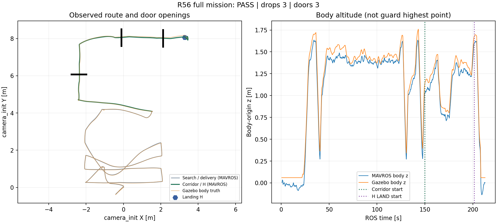
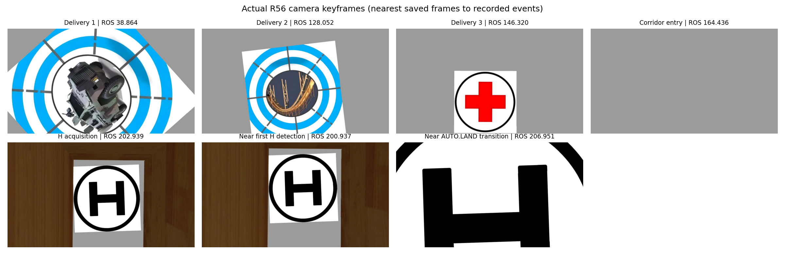

> 本文为R56原三框门验收。后续R57错列墙：0.85m PASS、0.80m FAIL，见[最新报告](../r57_toudi4/REPORT.md)。

> 适用性补充：接触代理对雷达不可见依赖“该包络不是实机实体护圈”的假设；实机几何尚未确认。碰撞 Gate 保留不等于传感器遮挡已逼真实机，详见[工程复核与当前模型图](../r56_model_review/REVIEW.md)。

# R4x—R56 整机竞赛工程最终报告

日期：2026-09-07。平台：笔记本 WSL2 / Ubuntu 20.04 / ROS Noetic / PX4 SITL / Gazebo Classic，视觉使用既有 rl_drone 环境和 GPU 六分类模型。机械投递为 mock Servo，本报告不把仿真提交计为真实落点得分。

## 最终结论

**R56 修复后完整 PASS，37/37 项 Gate 全部通过，错误与失败检查均为空。** 自动起飞、覆盖搜索中的三投、三次恢复、11 段投后路线、三扇门、H 对齐、AUTO.LAND、ON_GROUND 和 disarm 均有记录。碰撞、越界、超高均为 0，收尾确认零仿真残留。

实际飞行源码为整机 **`cc899f2bc4816caff9f9059adb0208705476f81b`**。对应导航修复 `286322f9b03fdcdab9b6b3efad1f02df4d3ca61c`，视觉开发分支 `0704d50fbe3eac7b90230dc3c00fca749b8a814e`，保留原始资产的 main 集成修复 `5a472a3455f229a78cd707037dd26d64bb7b0308`。报告、图表和交付提交在飞行之后，不冒充运行时源码。

Gate 任务时长 **182.924 s**，墙钟 **762.126 s**，实时倍率约 **0.240**。这里的仿真秒对应任务/飞行动力学时钟；笔记本运行较慢，不能据此宣称板端实时计算预算已通过。

- [原始 Gate](gate_status.json)、[成功摘要](success_summary.json)、[完整分析](r56_facts.json)、[实际任务事件](flight_events.json)。
- [全部运行时参数](rosparams.yaml)、[参数与阈值说明](PARAMETERS.md)、[相机 CameraInfo](actual_camera_info.json)、[PX4 参数读回](px4_parameters_readback.json)。
- [航迹与高度](route_trace.png)、[真实相机关键帧](actual_camera_mission.png)、[Nodes only 拓扑](topology/index.html)。
- [完整成功归档、原图回放与拓扑下载](https://github.com/Qinling-Melon-Farmers/liftrace-visionwork/releases/tag/sim/r2026-r56-contact-map-pass)；失败尝试不发布全量 Release。
- [本次根因与离线对照](../r56_root_fix/REPORT.md)、[此前 R56 失败事实](../r56/REPORT.md)、[R55 中断与恢复](../r55/REPORT.md)。

## 飞行分析

本轮目录：`/home/xhj/liftrace-worktrees/r2026-competition-integrated/logs/r2026_integrated_r56_contact_map_fix_20260907_112803`。经统一授权包装器运行，日志、bag、PX4 工作目录、分析和打包均留在 WSL 项目内；没有再将 run 写到 E 盘或其他盘。SITL 主命令返回 0，收尾输出 `PASS (no local ROS/Gazebo/PX4/RViz process remains)`。

| 阶段 | ROS 时间 / 结果 |
|---|---|
| 开始任务 | 28.250 s；自动起飞就绪后调用一次任务启动 |
| 第 1 投 | 40.396 s，panzer，槽 1，mock ACK 成功 |
| 第 2 投 | 130.554 s，bridge，槽 2，mock ACK 成功 |
| 第 3 投 | 147.567 s，red_cross，槽 3，mock ACK 成功 |
| 三投后路线 | 11/11 段成功，三次投后恢复成功 |
| H LAND 开始 | 201.682 s |
| 首个记录到的有效 H 映射 | 201.798 s；源图时间 201.735 s |
| AUTO.LAND 状态 | 207.779 s 首次记录；控制器模式请求成功日志在 207.574 s |
| ON_GROUND | 210.167 s |
| 任务完成 | Gate 任务耗时 182.924 s；末段另有 disarm 状态与正常收尾 |

三槽装满后结束搜索并返程，符合当前任务策略。本轮执行了覆盖搜索和高权重中断机制，但没有遍历剩余全部覆盖点，不能把“完整比赛流程通过”写成“每条覆盖航线都走完”。本次实际投递类别为 panzer、bridge、red_cross；其他类别、种子和靶位须继续统计。

### 三门

| 门 | 完成航段 | 穿越时横向坐标 | Gazebo 机体 z |
|---|---:|---:|---:|
| Wall_15 | 5 | -2.349869 m | 0.825206 m |
| Wall_20 | 8 | 8.097140 m | 1.410074 m |
| Wall_22 | 10 | 8.054356 m | 1.294672 m |

此前失败的 goal 19 坐标仍为 (-2.386703,5.672270,.75)，没有跳过或放宽到达条件。本轮第一次可执行轨迹等待 **0.072 s（ROS 时间）**，随后到达；此前同目标 90.04 s 没有 ready、113 次尝试失败。当前 26 个规划目标首条 ready 等待 P50=0.146 s、P95=0.203 s、最大 0.489 s，均由 bag 时间计算。这是端到端等待，不是搜索 CPU 用时或板端延迟。

### H、落地与高度余量

H 取景为 1.60 m，本次真实相机帧包含完整外圈和 H 结构；检测后完成对齐、锁存目标、下降，再由 PX4 AUTO.LAND 落地。下降后圆环出画没有导致重新爬升。本轮首个 H 映射为有效 camera_init 点，最终 Gate 标记误差约 .100 m。

Gazebo 机体原点最大 z=1.759874 m。按真实记录的模型四元数和未改动接触网格重建，接触代理最高点约 **1.982410 m**；它不是完整实机 CAD 的最高点，两者不能混用。触地确认时位置约 (3.433670,8.026226)，相对 H 中心误差 **0.162364 m**，在当前 .35 m Gate 内。真实落脚范围和竞赛评分仍须机械尺寸、风和实拍标定验证，不据此宣称满分。

关键帧为事件附近的已保存原图，图注给出实际图像时间；精确事件时间以上表与 bag 为准。另提供 4046 帧原图逐帧回放，叠加源 ROS 时间。视频固定 20 FPS，bag 时间戳是准确时序依据。原始与映射 H 输出合计 134 条条目，不是独立靶标数。

## R56 三次尝试与本次根因

| 尝试 | 源码/目录 | 结果与含义 |
|---|---|---|
| 第一次 | f0f7480，旧 E 盘 run | 启动墙钟 180 s 超时，未开始任务；原图 407 帧，记录缓冲溢出 6 次 |
| 同轮原生目录重跑 | f0f7480，WSL logs，09:39:16 | 三投/恢复 3/3，第一门前第 4 段超时；零碰撞；原图存在，缓冲溢出 0 |
| 根因修复后验证 | cc899f2，WSL logs，11:28:03 | 完整 PASS，37/37，三投三门与 H 落地完整记录 |

第二次失败证明外盘并非唯一原因。goal 19 被 FreeDOM 中的代表点 (-2.303706646,5.999974251,1.098791599) 膨胀覆盖；该点从 ROS 50.508 s 保留到 256.224 s。三个冻结时刻均可复现，普通点膨胀贡献 1，水平绕障列贡献 0。

后续原始扫描没有此点附近 10 cm 的新回波，但视线被仿真接触代理挡住，不能简单按年龄删除它。完整代理网格求交与 59/60 帧近回波吻合，最大误差约 1.13 mm；另一个问题是 .40 m 空闲体素的 26 邻域覆盖约 1.20 m，超过 .80 m 门宽，使靠近门框的旧点难以清除。

修正了两个根因：接触代理仍与世界发生物理碰撞，但不再作为激光不透明面；FreeDOM 空闲尺度改为 .10 m，保持 6 次观测和原连接规则。本轮起飞后 20 帧在线抽样每帧 9135—10756 个有效点，.5 m 内近回波总数为 **0**。完整 mesh 的 Gazebo ODE 对照仍能产生护圈—墙体接触；接触几何、传感器和所有飞行碰撞判据没有关闭。

另将增强深度图的名义视场纠正为记录对应的 [-7,52]°，量化范围改为 12 m；建图/射线范围 15 m 覆盖场地尺度，当前任务命令高度上限 2.30 m；点云输入队列 100→1，避免 TF 暂时不可用时大量旧扫描积压。没有增加规划器、ROS 任务桥或丢弃协议。

## R55 中断不能补记 PASS

R55 完成三投、11 段和三门后在 H 阶段中断，未完成 AUTO.LAND/落地，Gate 未写出，仍为 INCOMPLETE。F 盘耗尽解释末段 I/O 损坏；但其第一段 bag 从 0.409—28.128 s 已有 515 CameraInfo 而没有图像，在线图证明记录器订阅了无发布者的 compressed 话题。这与磁盘耗尽是不同问题。

H 模型实际为 1×1 m，旧 .75 m 机体高度与下移相机不匹配。水平解析估算外圈约 550 px，超过 300 px 且被裁切；1.60 m 下约 240 px。此前生产检测器离线拒绝/拒绝/检出 3/3 与本轮真实成像/降落共同支持修复，而不是用解析图冒充旧真实画面。

## R4x 以来各次改动

能定位的最早保留完整成功为 R41；未找到可核实的 R40 完整记录。R41 的 429.875 s 功能 PASS 包含旧 Gate 墙钟字段的离线误判修正，并非原始未修正 Gate 38/38；本次没有重放已缺失的完整 R41 原始 run。不能把旧 9 航段成功冒充 9/9 场景统计，或声称本次复用了未核实的 8/8 走廊专项。

| 阶段 | 实际问题 | 改动与作用 | 验证边界 |
|---|---|---|---|
| R42/R43 | 退休 goal 误伤新目标、偏移终点到达与原门洞不一致 | 清理旧目标事件，原门前/后坐标判定 | R42 三投后 90 s 仍未到首点；R43 在 445.849 s 撞门，均非整场 PASS |
| R41 历史基线 | 历史场景需要完整闭环 | 三投、9 段、三门、H 自主降落 | 429.875 ROS 秒；不代表新机架场景通过 |
| R44 | 回弯处几何最近点跳向未来路段 | 沿实际执行进度限制前视弧长，并固定样条端点 | 消除跨段前视跳变，不引入第二套路径执行器 |
| R45 | 第一门上梁碰撞 | 按机体上方护圈修正垂向膨胀，逐靶恢复取景高度 | 向下膨胀 0.30 m、向上 0.10 m；后续还发现定位源问题 |
| R46 | 用户要求转整场 | 恢复已验证的规划动态包络并停止专项 | 中止轮次不计 PASS |
| R47—R48 | LIO 与 PX4 高度参考不一致，机顶雷达地面回波不足 | 核正雷达 IMU 外参、定位原点与传感器测高分工 | 三投可完成，仍须解决低空垂向漂移 |
| R49 | 正装雷达下向射线被机架碰撞盒遮挡 | 使用可看见地面的仿真支架，并按实际正装方式建模 | 不用倒装模型替代用户实机安装 |
| R50 | 飞控高度融合参数设置时序、仿真噪声不一致 | 恢复飞控 IMU/气压计参考，经 PX4 原生启动入口加载参数 | 飞控测高与 LIO 水平约束共同工作 |
| R51 | 近目标解析连接受阻就退出 | 连接失败后继续水平避障搜索；校正外部 AUTO.LAND 开关类型 | 三投/恢复、零碰撞；门前仍超时 |
| R52 | 绕树路径拟合太稀、优化切角 | 加密离散路径与样条拟合，保留通过净空检查的初始曲线作回退 | 冻结地图复现有效，不能替代整场 |
| R53 | 门前短目标仍生成远距离绕行，搜索阻塞地图 | 完整记录三投后首个失败目标 | 三投 3/3，门前超时 FAIL |
| R54 | 新高度下直接接近窄门容易不可达 | 沿旧成功中心线加入门外分段降高、低位观察、对正和清出点 | 三投，门前第 4 段仍超时；零碰撞 |
| R55 | 10 cm 体素封堵门前目标；短目标放行无进展 horizon；同步搜索占用过久 | 5 cm 地图、精确体素膨胀、短目标完整路径、有界搜索、目标占据快速拒绝 | 7/7 离线；三投、11 段、三门、零碰撞；H 段中断 |
| R56 | 1 m H 与低位安装相机在 0.75 m 取景不匹配；日志和宿主空间不足 | 同步 H 取景高度、实际录图、独立日志盘、宿主 VHDX 压缩 | 以本轮实跑结果为准 |

## 让仿真接近实机的工作

1. 场景去掉 bigbox，四棵障碍树加约 0.30 m 垫座，总高约 1.50 m。搜索区由实时雷达点形成竖向占据列，使路线水平绕树；真值只用于评测。
2. 机顶正装 MID360，自带 IMU 到下视相机严格为 0.21 m。雷达 IMU 在机体 z=0.12412 m、相机在 z=-0.08588 m；光线渲染和 ROS TF 均随机体姿态变化。
3. 核正雷达射线原点与 IMU 原点差值，向飞控发送定位时换算至机体原点；FreeDOM 使用融合后的机体 TF 建图，避免一边规划用 LIO 高度、一边执行用另一高度。
4. 保留飞控盒自身 IMU 和气压计测高，LIO 主要提供水平位置与航向约束。具体 EKF/传感器噪声参数以本轮 PX4 读回值为准，不能把仿真噪声配置直接当成实机标定。
5. 使用 1280×720 的 KS2A543 标定主点与畸变；Gazebo 实际 fx=fy=725.351，实机标定 fy=723.340，约 .28% 差异，不宣称逐项完全一致；相机安装改变了短边视场和目标居中偏差。搜索 1.4 m、投递取景 1.6 m，H 取景本轮改为 1.6 m；靶槽静态、动态补偿仍为零。
6. 护圈碰撞几何位于机体上方约 0.20 m；水平膨胀 0.30 m、上方障碍向下膨胀 0.30 m。日志中的机体原点高度不能冒充护圈最高高度。

仿真仍不能替代真实光照、模糊、滚动快门、机架遮挡、雷达反射、磁干扰、气压漂移、风和载荷动力学；这些是后续实机验收内容。

## 规划波动为何改善

任务层独占目标入口，执行器沿当前轨迹进度跟随，过期规划事件不能切换当前任务。回弯前视限定为局部弧段；样条保持端点并做完整占据/ESDF 检查。优化轨迹若不安全，只能使用同样通过检查的初始曲线。

R55 地图分辨率从 0.10 m 改为 0.05 m，地图边界 12×22×3 m、原点 (-6,-11,-0.2)，约 633.6 万体素。这样能表示保留护圈余量后的窄门，而不是缩小机体膨胀伪造可达。点云只量化一次并连续填充 z 单元，点云/里程计队列为 1，地图可视化 5 Hz。

占据目标直接拒绝；短于 horizon 的目标必须生成完整路径。远目标 horizon 路段必须向目标至少推进 0.20 m。每次搜索尝试限制 0.25 s 墙钟时间，内循环也检查预算；保留既有重试，避免一次搜索阻塞几十秒导致地图陈旧。短距离目标先尝试有碰撞检查的解析连接。

R54 同一 goal 19 的首次可执行轨迹约等待 36.6 s，R55 为 0.203 s；R55 飞行阶段膨胀地图最大已记录消息间隔 0.365 s。第一门穿越目标曾拒绝一次净空不足的曲线，约 1.833 s 后形成有效轨迹并通过。改进来自可达性与调度修正，未放宽碰撞 Gate。

R42 的原始统计为 326 次规划尝试，其中 301 ready、25 failed；90 s 内距目标 1.893→.958 m，实际行程 9.39 m。R43 的门左侧碰撞前 x=-3.485 m，超出门洞范围；R45 则是上梁碰撞后向左偏，不能混为同一侧偏根因。R41 原地图膨胀 .20/.20/.10 与当前护圈 .30/.10/.30 不同，不宜整套回滚。

本次最终补充：FreeDOM 清空尺度、接触代理光学语义、视场与输入队列修正已经通过本轮完整实跑；H 高度的实跑缺口也已关闭。原 R41 的 429.875 s 功能 PASS 带旧墙钟字段离线修正，原始未修正 Gate 不是 38/38；R42/R43 不是 8/8 或 9/9 走廊统计。本报告不伪造缺失 R40 记录，也未重放本机已缺失的 R41 全量 run。

## 让仿真接近实机的当前配置与限制

- 四棵障碍树加约 .30 m 垫座至约 1.50 m，移除 bigbox；搜索区水平绕行由实时点云形成占据列，真值只用于评测。
- 正装机顶 MID360，自带 IMU→下视相机严格 (0,0,-.21) m；body→IMU z=.12412、body→camera z=-.08588、body→ray=(.011,.02329,.13)。渲染相机与 ROS TF 使用安装外参并随姿态运动。
- LIO 约束水平/航向，飞控自身 IMU/气压计负责高度参考；原生 PX4 启动期加载 EKF 参数。FreeDOM 使用融合机体 TF 与 IMU 外参，不另用不可观测的 LIO 高度定义地图。
- 相机实际 CameraInfo 为 1280×720、fx=fy=725.351、cx=631.672、cy=397.566；实机标定 fy≈723.340，约 .28% 差异。不能把当前仿真写成全部成像误差已标定完毕。
- 仿真接触代理只承担保守接触几何；真实护圈 CAD、真实机架遮挡、光照、模糊、风、载荷和气压漂移不由这一轮代替。槽位补偿仍为 0。

## 参数、阈值和工作链

[PARAMETERS.md](PARAMETERS.md) 包含关键值、配置源全文、11 航点、门几何与新 FreeDOM profile；[rosparams.yaml](rosparams.yaml) 是本轮参数服务器完整导出，包含所有实际加载值。第三方包的可选深度模式参数不等于当前点云入口正在使用它们。PX4 八项关键参数实际读回全部成功。

任务 Manager→唯一 Planner Bridge→Fast-Planner→轨迹服务器→patrol_control→MAVROS/PX4 为当前控制链；视觉 typed 目标、对齐和释放证据参与三槽提交；旧视觉兼容桥、旧覆盖管理器和老 Servo topic 控制未在正式入口启动。Servo 服务定义和 /legacy/Servo_raw 是仍在使用的接口，不能仅因名字含 legacy 而删掉。精简分支不含机械 PWM 实现或原始参考工作区。

拓扑来自本轮在线 ROS master 注册，再以 rqt_graph 的 NODE_NODE_GRAPH 离线绘制：椭圆为节点，边文字是 ROS 话题，箭头从发布者指向订阅者。完整图含记录/观察辅助节点，核心图便于阅读。37 项运行 Gate、11 项注册接口检查与包装器源路径校验各有不同用途，不把注册图当成吞吐性能测试。没有利用绕过碰撞、强制到点、虚假提交或真值输入获得 PASS。

## 存储、分支与发布

此前删除 47.69 GiB 冗余日志，随后清理 R54/R55 本地重复 bag 14.56 GiB；VHDX 实际压缩由 165654036480 降至 92571435008 字节，向宿主回收 68.06 GiB。新增实验日志会重新占用部分空间，删除文件量与 VHDX 实际回收量不能混用。

R53 过时 Release 已清理，源码 tag 与分支保留；R54/R55 历史根因/恢复对照保留。本轮失败尝试只提交报告与小产物，不全量发布 Release。成功全量记录在 WSL 内打包并上传；具体附件、保留与清理清单见交付索引。

精简整机分支为 liftrace-visionwork/feat/r2026-competition-integrated；main 集成分支保留原始资产，以 --no-ff 合入 main 并保留功能分支、打 annotated tag；导航同步到 liftrace-controlwork/feat/vcl06-local-full-mission 的现有 fork 分支。实际运行源和合并/交付版本分开记录，见 [交付说明](DELIVERY.md)。

## 竞赛鲁棒性还剩多少工作

当前这一完整配置有一次全流程 PASS，软件功能闭环阻断已关闭；不等于跨场景稳定率、板端实时性或实机满分验收。还剩五项明确验收工作包：

1. 固定版本多 seed、靶位与门偏移、初始化与负载变化，统计三投、过门、H、超时和延迟；覆盖本轮未投的类别。仿真实时倍率 .240 尤其不能替代实时预算验证。
2. OrangePi RKNN + ROS 真实相机/CameraInfo/TF、时钟、10 min 连续运行与负载/功耗。已有板端离线推理速度不是这个验收。
3. 实机内外参、雷达安装/地面可见性、飞控 IMU/气压计与 LIO 一致性；进一步压缩当前约 .162 m 的落地偏差及真实轮廓余量。
4. 实拍光照/模糊、风与载荷、材质回波、掉帧/失定位、遥控和急停接管。实机动作仍需另行明确授权。
5. 机械组舵机/三槽 ACK、真实投放和实际落点；按用户要求暂不做槽位偏差补偿。

优先完成板端实时链与静态安装标定，再做受控低空实机联调和场景统计。不使用未经测量的“完成百分比”或保证比赛成功率。
