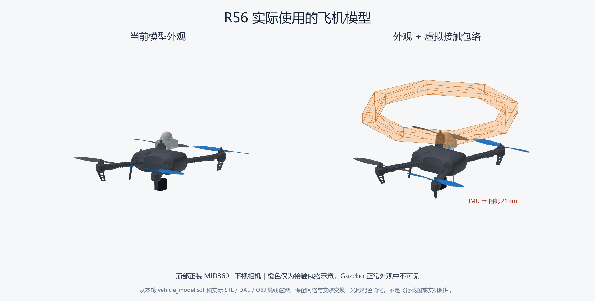

# R56 最后修复的工程适用性复核

2026-09-07，应用户要求复核。未启动新仿真，未修改飞行代码、运行参数、原 Gate 或成功源标签。

结论：建图与调度调整有工程依据；接触代理的射线过滤是带条件的仿真建模选择，不能无条件称为“实机遮挡根治”。R56 的 37/37 PASS 是当前模型下真实完成的功能记录，不能用它证明真实护圈已经正确建模。

| 改动 | 工程依据与验证 | 适用边界 |
|---|---|---|
| FreeDOM 空闲体素 .40→.10 m | 原 26 邻域跨度约1.20 m，大于.80 m门洞；生产代码几何回归中新尺度第6帧清除旧点，门梁保留 | 板端计算负载、位姿噪声和误清空率仍需实测；不是实际无遮挡扫描回放 |
| 视场 [-7,52]°、建图范围15 m、增强深度12 m | 对齐现有正装MID360扫描与室内场地尺度，改善8位深度量化 | 范围是竞赛配置，不是所有场景默认；原始雷达和LIO量程未改 |
| 点云队列100→1 | 限制陈旧输入积压，保留源时间TF转换 | 会丢弃等待队列里的旧帧；必须检查板端实际处理率，不能声称零丢帧 |
| H取景 .75→1.60 m | 一米H与下移相机在低位视场不完整；检测器离线对照及本轮H降落支持 | 是传感器视场设计；保留当前高度/碰撞要求，不等于实际落脚精度验收 |
| 仅接触代理对LiDAR不可见 | 原OBJ近处求交与59/60帧回波吻合；过滤后ODE护圈—墙体仍产生接触 | **只有该几何是额外虚拟碰撞包络、而非该位置的真实不透明护圈时，这项选择才合理** |

## 不能省略的条件

当前接触包络是单独的 `competition_contact_link`，中心位于机体 z=.20 m，厚 .04 m、外顶点半径 .30 m，质量1 g，无 visual。最早提交 `976b51e` 即把它标为 simulation-only 接触包络；这些证明代码的设计意图，不能替代实机尺寸测量。

最后的插件只过滤该包络的射线碰撞，现有 iris 机身、旋翼和 MID360 模型未被过滤；但“已有模型保留”也不等于真实机架外形已准确表达。原碰撞传感器、包络网格、安装高度、规划膨胀、11个航点和 Gate 未放宽。过滤确实改善了传感器可见性，因此不能仅用“碰撞还在”推导“没有使仿真乐观”。

用户确认的是 MID360 正装于机顶、IMU 到相机垂直21 cm；尚未确认真实护圈/支架的完整尺寸与遮挡。若真实实体也位于这段扫描光路中，它必须同时参与射线和物理碰撞，不能套用接触代理过滤。应按实机CAD或测量建立实体碰撞/可见几何；额外接触余量才使用仅接触代理。先静态扫描核实可见扇区与地面回波，必要时调整实际支架或飞行策略，再作整场复验。

原始门前占据点在ROS 50.508 s首次出现；后续盲带和清空尺度有证据，但现有分析**未直接证明最初那个点就是接触代理生成的假点**。因此本轮修复了已复现的遮挡与持久清空问题，不能扩大为地图全部误点来源已被穷尽。

## 当前飞机图片

本轮没有保存飞机外观视角录像。此图从成功 run 的 `vehicle_model.sdf`、实际 iris / mid360 SDF 和 STL/DAE/OBJ 离线生成，使用 Gazebo 自身 MeshManager 导入网格，保留安装变换；光照配色简化，旋翼静止。它不是正在飞行的截图或实机照片。橙色是额外显示的接触包络，正常Gazebo外观里不可见。来源清单见 [model_image_sources.json](model_image_sources.json)。图中全部仿真外形均不冒充实机CAD。

## 临时目录清理

清理 WSL `/tmp` 中已结束的项目仿真日志、临时编译、干净诊断克隆与旧安装解包缓存；系统套接字、其他应用文件及未确认用途的临时项保留。成功完整归档和工作区源代码未删除。必要复现脚本/小结果先归档到项目 `logs/_artifacts/r56_model_review/tmp_reproduction_summaries.tar.gz`。

本次删除 849 个顶层临时项，文件内容约 1.995 GiB；保留的小材料压缩包约 4.46 MiB。释放的是WSL文件系统空间，未执行VHDX压缩，不把它宣称为宿主物理磁盘已缩小。
