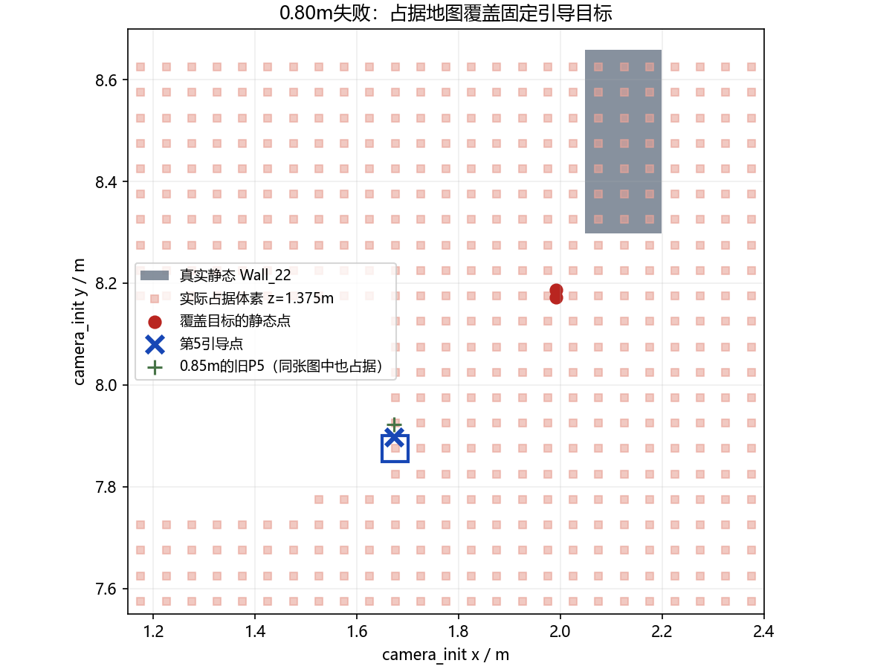

# 严格0.80m轮次失败分析

本轮为FAIL，当前仿真与诊断观察节点均已停止。按用户最新指令收尾，不再开新仿真；十组不同seed的前置条件没有满足，执行数为0。0.85m PASS保留，不能替代严格0.80m验收。

## 直接失败位置与阶段

- 三投、三次恢复完成；投后路线前4/7段完成，入口和第一处错列通口通过，碰撞、越界、超高均0。
- 第5点/goal 20为 `(1.673022, 7.897277297, 1.40)`，位于第二块错列墙西侧。固定目标在地图内，并非越出地图边界。
- 该段开始约ROS186.37s，约276.39s以`safety_motion_timed_out`进入ABORTED，符合90s运动事务时限。后续第二处通口、H对齐和降落未执行。
- Gate完整任务耗时为null；从首个SEARCH状态到ABORTED观测跨度约248.062s。不能把未完成的时间检查解读为超过600s全场时限。

## 已复现的占据原因

ROS240.088、241.110、251.025三份独立地图快照均显示目标体素占据。按当前生产代码的量化与膨胀方式重建：5cm网格，原点(-6,-11,-.2)，目标索引(153,377,31)，中心(1.675,7.875,1.375)。两个普通静态点贡献了占据，水平绕障列贡献为0：

| 静态点x | y | z | 距实际Wall_22包围盒 |
|---|---|---|---|
| 1.991004229 | 8.171953201 | 1.551247120 | 0.137685m |
| 1.991179705 | 8.186601639 | 1.651183009 | 0.124419m |

这两个点都落在源体素x=159、y=383，与目标在XY上各差6格；当前0.30m方形膨胀正好覆盖目标格。Z方向也在既有向下6格、向上2格范围内。目标被拒绝符合规划器当前碰撞规则；不应通过删点白名单、缩小机体余量或放宽到达门限强行完成。

两个点首次出现在FreeDOM输出ROS190.623s，一直保留至276.497s，匹配857帧，持续约85.874s。Wall_22在Gazebo ModelStates中全程位置与姿态未变，源模型也是static=1；不存在墙体被动力学挤动导致通口变窄的证据。

0.85m旧P5比0.80m向北2.5cm，落在相邻体素，但把该旧点放进同一张0.80m冻结图仍被占据。因此不能把原因简化为“换回上一个点”或仅仅2.5cm跨体素边界；两轮的观测与建图也有差别。

## 位姿与地图边界的一致性

两个点首次出现时，附近时间样本给出的水平位置误差为：

| 估计源 | x估计−真值 | y估计−真值 |
|---|---|---|
| FAST-LIO `/Odometry` | +0.0112m | −0.0704m |
| MAVROS融合位置 | −0.0673m | −0.1212m |

FreeDOM当前使用融合机体TF变换IMU系点云；该时刻的融合位置偏差与两个墙角点约5.7cm向西、11–12.5cm向南的偏移方向和量级一致。随后静态代表点持续保留，经方形体素膨胀覆盖按名义世界坐标布设的目标。严格0.80m相对0.60m包络仅有每侧0.10m名义余量，已经不足以吸收本次约0.12m的横向误差，再叠加5cm量化和方形角部膨胀。

已确认的失败链条是：**估计/地图边界与先验航点坐标不一致 → 两个静态占据点持续保留 → 固定引导点落入膨胀地图 → 规划拒绝并重复尝试 → 90s运动超时**。这不代表已将水平误差完全拆分为SLAM漂移、飞控融合滞后和TF时序误差；采样位姿对照也不是完整的每束射线时间重建。本次不把这些尚未独立验证的分量说成定论。

## 后续建议（本次未实施、未复飞）

1. 先处理LIO、MAVROS融合位置与点云源时间的横向一致性，核对这些误差在低速靠近时能否稳定压到通口余量以内；当前已知偏差不能只靠增加航点数量解决。
2. 保留先验航点用于引导，在接近阶段依据实际观测的走廊边界确认可达中心线；保持规划膨胀与独立通行截面判据，处理固定目标占据后的路线重选。不要把仿真真值送进在线规划或控制，也不要恢复无条件目标偏移。
3. 严格0.80m完整闭环通过后，再启用十组不同靶标seed验证。按用户最新要求，后续默认关闭全场bag，只保留run.log、Gate/参数/任务及释放状态等关键TXT/JSON，必要时采集局部诊断材料。

## 收尾与文件

两轮Gate、参数、实际轨迹与关键信息均已提取，记录缓冲溢出为0。本轮完整收尾返回退出码1，原因是Gate FAIL，进程清理本身PASS。0.80m失败配置不合入main，不发布失败全量Release；现有分支保留并推送报告。

原始诊断见[diagnosis.json](080/diagnosis.json)、[point_trace.json](080/point_trace.json)、[estimator_comparison.json](080/estimator_comparison.json)。三份局部NPZ和关键图像留在本地run，完整bag已在关键信息提取后按最新保留偏好清理；原bag中的图像数量保留为统计，当前仅保留关键图像样本。
