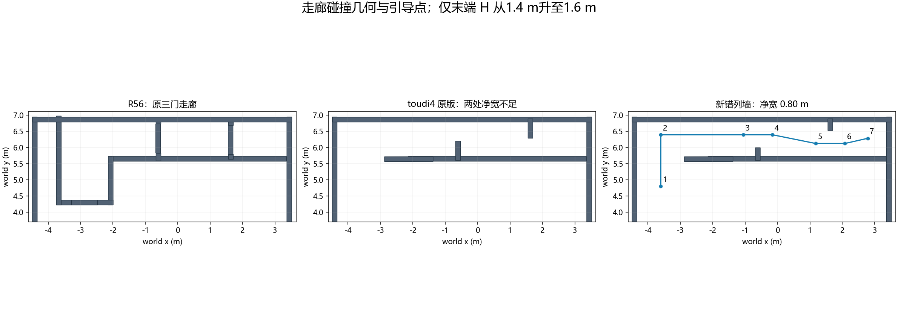

# R57 toudi4错列墙、两阶段实跑与去年航点对照

2026-09-07。平台为笔记本WSL2 / Noetic / PX4 SITL / Gazebo；三投使用mock Servo，非实机舵机或实际落点验收。

## 结果

| 实际通口净宽 | Gate | 投递 | 投后航点 | 通行截面 | 任务ROS秒 | 任务墙钟秒 |
|---|---|---|---|---|---|---|
| 0.85 m | PASS 37/37 | 3/3 | 7/7 | 3/3 | 180.229 | 892.914 |
| 0.80 m | FAIL 22/37 | 3/3 | 4/7 | 2/3 | 未完成 | 未完成 |

0.85m完整通过并收尾后，才按用户要求收紧到严格0.80m。两轮独立启动、独立日志、独立源码；0.85m记录不算作0.80m通过。三处截面是入口及两处错列墙绕行通口，不能冒称原三扇框门的竞赛评分。

**最终严格0.80m未通过。** 三投和三次恢复完成，前4个投后点、入口及第一处绕墙口通过；第5个引导点被膨胀地图占据，90秒运动超时后ABORTED，未执行第二处绕墙通过和H降落。当前请求按用户“失败则分析报告收尾”的条件停止，未启动十组seed；失败配置未合入main。失败轮Gate完整任务耗时字段为null，不表示超出600秒全场时限，实际触发是单段运动超时。

详细原因见[失败分析](FAILURE_ANALYSIS.md)，两轮实际轨迹见[0.85m](085/flight_route.png)、[0.80m](080/flight_route.png)。

## 世界来源与实际修改

原运行入口为 `navigation_horizontal_search_vcl06.launch`，加载 `uav_vision_eval/models/r2026_horizontal_field/field.world`。该世界派生自导航组 `toudi3_random.world`，已有去bigbox、树垫高到约1.5m、机顶正装MID360和下视相机配置。

这次从导航仓库 `patrol_sim_ws/src/sim_env/env_map/worlds/toudi4.world` 提取走廊墙体样式。移除旧toudi2内Wall_14/15/16/20/22，保留场地外墙与Wall_13，加入原版独立Wall_14/20/22。搜索树、双H、随机靶场范围保持原配置；未导入原版bigbox或固定靶标。

原版toudi4两处实际净宽约0.598m、0.562m。用户明确同意保留错列墙样式并扩大通口，随后要求先0.85m通过、再严格0.80m。修改保留短墙与边界相接的一端，只调整侵入走廊的长度；视觉与碰撞框同步。实际尺寸按完整安装变换计算，数值误差小于1e-8m，非原版尺寸直接通过。

## 航点与规划方式

今年R56有11个投后点，包含低门前分段降高、观察、对正、清出与H取景。新错列墙没有旧低门横梁，改为6个走廊点加1个H取景点。走廊保持1.40m，末点H取景1.60m；保持在线Fast-Planner生成和验证曲线，执行器跟踪当前曲线。没有新增直接飞点执行器、状态机分支或ROS桥。

本次未修改Planner源码、规划膨胀、搜索策略、相机外参、机架接触包络或释放链。只调整世界、引导点和评测截面；Gate增加可配置的预期截面顺序，旧三门顺序仍为默认，丢失/错序/越界/反向通过和碰撞仍被拒绝。原40项Gate回归与新增4项回归通过；整机Catkin构建通过。

严格0.80m引导点（camera_init；原点world=(-0.493412,-1.772690)）：

| 点 | x/m | y/m | z/m |
|---|---|---|---|
| 1 | -3.106588 | 6.572690 | 1.40 |
| 2 | -3.106588 | 8.167690 | 1.40 |
| 3 | -0.562003 | 8.167690 | 1.40 |
| 4 | 0.337997 | 8.167690 | 1.40 |
| 5 | 1.673022 | 7.897277 | 1.40 |
| 6 | 2.573022 | 7.897277 | 1.40 |
| 7 | 3.274292 | 8.057220 | 1.60 |

0.85m引导中心线最小距墙0.425m；0.80m为0.400m。规划XY膨胀0.30m、净空阈值0.025m、地图分辨率0.05m保持不变。这是名义引导几何，实际飞行轨迹和碰撞结果分别见各轮记录。

## 去年机载工程到底是多少点

依据从机载拷回的基线 `0ddc845` 中 `patrol_control/config/patrol_real.yaml`，实机 `patrol_control_real.launch` 确实加载该文件。完整表有16个点；`waypoint_skipping_index: 8`，旧控制在三投完成后跳到最后8个点。

因此走廊返程段是 **7个Nothing_point + 1个Land_point，共8点**，对应4组不同XY：入口1组，两处各含0.65→0.15→0.65m高度点，末端降落1组。不能把8个点理解成8个独立障碍或8次成功试验。

| 返程点 | x/m | y/m | z/m | 类型 | 悬停/s |
|---|---|---|---|---|---|
| 1 | 6.50 | 3.63 | 0.65 | Nothing_point | 0.0 |
| 2 | 8.08 | 1.80 | 0.65 | Nothing_point | 2.0 |
| 3 | 8.08 | 1.80 | 0.15 | Nothing_point | 2.0 |
| 4 | 8.08 | 1.80 | 0.65 | Nothing_point | 1.0 |
| 5 | 8.19 | -1.90 | 0.65 | Nothing_point | 2.0 |
| 6 | 8.19 | -1.90 | 0.15 | Nothing_point | 2.0 |
| 7 | 8.19 | -1.90 | 0.65 | Nothing_point | 1.0 |
| 8 | 8.29 | -4.40 | 0.75 | Land_point | 0.0 |

旧配置 `switch/flag_planner_px4: 0`，实机launch包含 `patrol_planner_real.launch`，核心方式也是预先测量关键点、状态机依次派发目标、在线规划避障、跟踪轨迹。与今年的技术方式相近。今年由独立Mission Manager完成全场搜索、三投和返程，旧执行器负责轨迹跟随与末端动作；新布点遵循当前墙体、1.4m巡航和相机安装条件，没有照抄去年的低高度坐标。

导航仓库另一个旧副本的 `patrol_real.yaml` 有8个总点且没有 `waypoint_skipping_index`，并非上述机载任务表。本报告按可追溯的机载拷回基线计数，不据此声称找到了去年的完整比赛飞行日志。

## 参数、记录与适用边界

两轮 `085/`、`080/` 分别保存Gate、摘要、实际参数、运行时场景/航点和轨迹图；源码提交写在各自summary中。原bag已完成离线提取；按最后要求只保留文本/JSON、轨迹CSV、关键地图和相机样本，并清理这两轮全场bag。本轮未新增Release，不发布失败全量记录。搜索/投递逻辑及600s任务时限保持原配置。

两轮仍共享之前的虚拟接触包络假设；真实护圈/支架若挡住雷达，必须在实体模型中保留遮挡，不能把这些PASS当作实机安装验证，详见[工程适用性复核](https://github.com/Qinling-Melon-Farmers/liftrace-visionwork/blob/main/docs/verification/r56_model_review/REVIEW.md)。一次0.80m通过不代表多seed稳定率、板端实时性或实机鲁棒性已验收。
