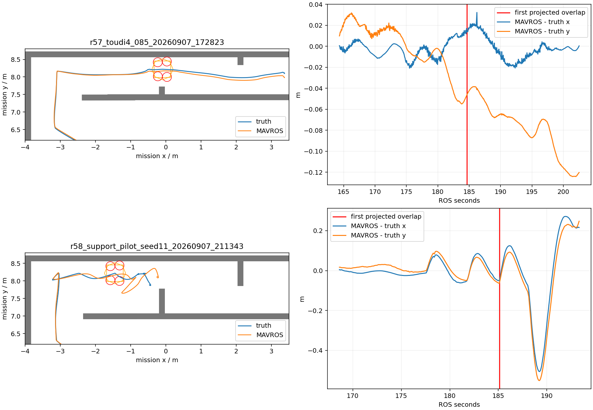
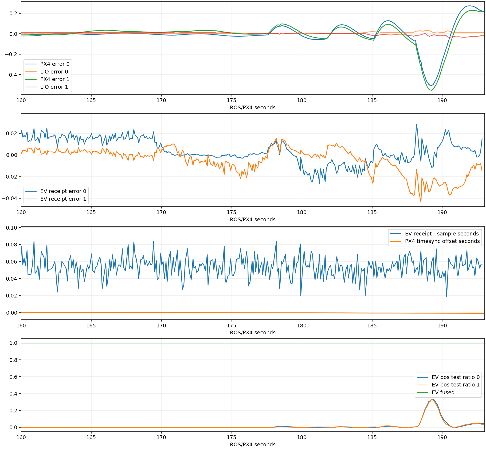
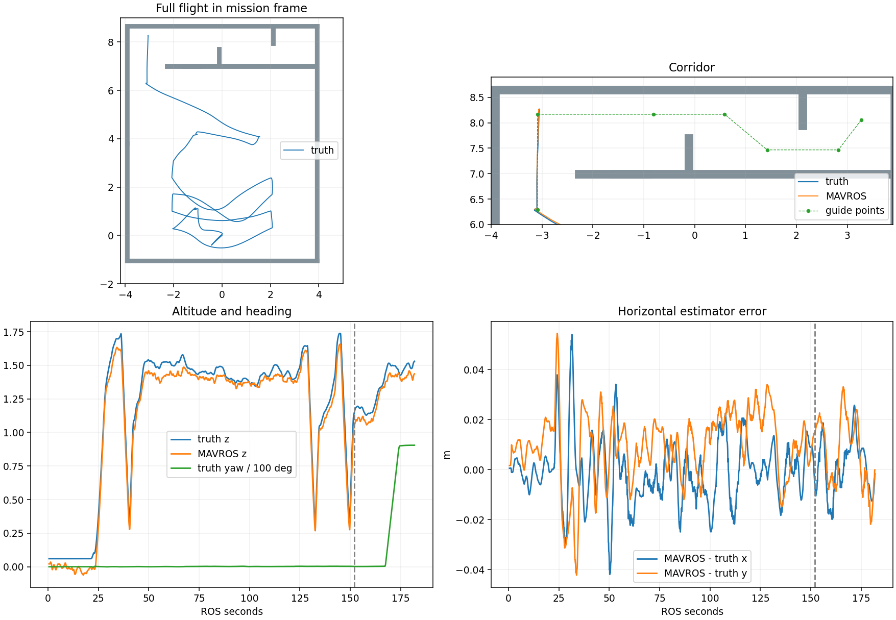
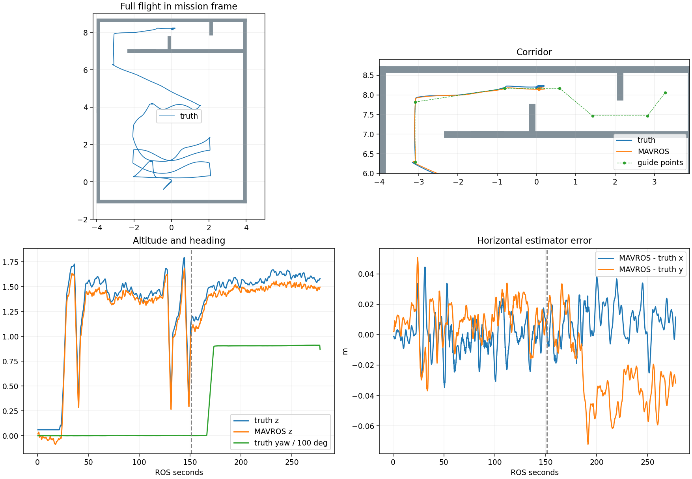

> 本文件为分阶段历史记录，阶段性的“待实跑/下一步十seed”已停止执行。最终结果为59ed04b三投后外墙接触FAIL，十seed0组；最新要求及结论见[收口报告](../r58_closeout/REPORT.md)。

# R58：1.50 m 错列走廊、0.80 m 通口与机架朝向

## 当前结果与可复用基线

**R57 的 0.85 m 全场 PASS 仍是有效的历史成功记录；严格 0.80 m 没有通过。** 不能把二者合称为“R57 失败”，也不能把单次全场成功写成多 seed 稳定性通过。R56 完整验收仍保留在 main，实验修复留在功能分支。

| 轮次 | 实际结果 | 首个失败阶段 |
|---|---|---|
| R57 / 0.85 m，源码 `7035415` | 37/37 PASS，三投、走廊、H 降落 | 无 Gate 失败 |
| R57 / 0.80 m，源码 `655bf2a` | 三投，4/7 投后点，2/3 通行截面，FAIL | 第二短墙前目标占据，90 s 超时，无护圈接触 |
| R58 首轮 seed11，源码 `2e4655c` | 首投后 FAIL | 孤立地图点被外推为全高障碍柱，覆盖第二靶接近点 |
| R58 结构支持修复 seed11，源码 `63f8ade` | 三投恢复，3/7 投后点，FAIL | 192.717 ROS s 护圈接触 Wall_20 |
| R58 航向修复，源码 `a063d10` | 三投、90°转向完成，FAIL | 入廊停点外墙护圈接触 |
| R58 入廊中线停点，源码 `f3d9f34` | 三投、入廊、首通口截面，FAIL | 原门后点更新后占据，90s超时，零碰撞 |
| R58 恢复邻域选点，源码59ed04b | 三投后FAIL | 第一短墙前外侧长墙护圈接触；十seed暂停 |

前两轮完整结论、参数和飞行图见 [R57 报告](../r57_toudi4/REPORT.md)。R4x 到 R56 的全部历史、飞行高度、安装外参、建图及重规划改动见 [R56 完整报告](../r56_final/REPORT.md) 和 [参数表](../r56_final/PARAMETERS.md)。这些记录不被新的实验覆盖。

## 为什么出现“越改越坏”

本次对照中变化了场景几何、航点和后续柱体生成规则，不能据两次失败断言每个改动都损害了算法；但也不能把未验证的修正先称为稳定性提升。R57 世界的走廊总净宽实际约 1.0704 m；用户明确要求 1.50 m 后，R58 校正了下侧长墙，两处通口保持严格 0.80 m。虽然总宽增加，第二通口位置与转移路线也发生变化，已经不是原 0.85 m 场景的原样回归。

首轮的附加柱体失败已在冻结地图中重现：普通三维膨胀没有覆盖第二靶目标，只有单点生成的全高柱覆盖。增加结构支持后，第二轮重新完成三投；不能将随后走廊碰撞直接归因于这项搜索区修复。

**前期没有把机架相对走廊的朝向和护圈统计范围检查完整，是本轮需要纠正的工程遗漏。** 不应继续围绕固定 XYZ 航点盲目堆参数，也不应重新设计去年已经使用的机架。

## 碰撞前的实测与判断边界

本地诊断数据位于 `logs/_artifacts/r58_corridor15/`，原始失败 run 为 `logs/r2026_r58_support_pilot_seed11_20260907_211343/`。

- 192.717 s 的 Gazebo 护圈接触是真实物理接触事件，不是地图占据判定。
- 对两道短墙的采样轨迹回放未找到更早的桨盘重叠；扩展到所有外墙后，185.104 s 出现 rotor_2 与外侧长墙约 0.34 mm 的投影重叠。它是比护圈事件更早的几何接触迹象，原始护圈传感器没有记录桨盘接触力，不能据此唯一确定全部动力学因果。
- 189.0 s，PX4 水平估计相对 Gazebo 真值约为 `(-0.489, -0.533) m`；同刻 LIO 水平误差约为 `(+0.035, -0.021) m`。因此不能笼统地说“LIO 漂了半米”。
- PX4 ULog 中外部位置观测持续融合，采样年龄全程 P50 51.1 ms、P95 74.6 ms、最大 96.0 ms；188–192 s 没有位置/航向重置，也没有外部位置创新拒绝。明显波动主要出现在飞控预测/融合输出及实际运动中。
- MAVROS 时间同步周期性重置在 0.85 m 成功轮也存在。PX4 接收时间与 LIO 样本时间在本轮未呈现半秒级错位，暂不能把它定为此次碰撞的根因。MAVROS 1.20.1 的同步实现可参考 [官方源码](https://raw.githubusercontent.com/mavlink/mavros/1.20.1/mavros/src/plugins/sys_time.cpp)；本次没有为消除告警而关闭同步或放宽观测有效期。
- R57 0.85 m 轨迹在两道短墙的采样最小分离约 1.09 cm；扩展到长墙后有约 0.14 微米的数值重叠，处于数值误差尺度，不能据此改判历史 PASS。旧 Gate 仅直接观察护圈接触，其统计范围须如实标注。

R57 严格 0.80 m 的另一条失败链仍成立：两处墙点偏移约 12–14 cm，普通膨胀覆盖原第 5 个目标。新航点沿墙前后方向退远，解决的是目标位置过于靠近墙角的问题；它没有被写成“所有定位误差已根治”。

## 参照去年设计的最小飞行修复

去年实际启动文件 `patrol_control_real.launch` 使用 `patrol_real.yaml`。该文件共 16 个任务点，从 `waypoint_skipping_index=8` 起的返程/走廊部分共 8 点：7 个普通点和 1 个降落点，包含同一 XY 的高低高度重复点，只有 4 处不同 XY。主要走廊段由 `(8.08, 1.80)` 飞向 `(8.19, -1.90)`，即沿 Y 飞，全部 yaw=0。它采用关键点引导加在线 Planner；今年按关键点推进同一类在线规划，技术方式一致。8 个点不等于 8/8 次专项通过。

本机实际加载的 iris 基础模型保持原样。四个桨盘半径均为 0.128 m，电机位置分别为 `(0.13,-0.22)`、`(-0.13,0.20)`、`(0.13,0.22)`、`(-0.13,-0.20)` m。机架与既有护圈代理一起计算，yaw=0 时 XY 外包跨度约 `0.600 × 0.696 m`；yaw=90° 时约 `0.696 × 0.600 m`。这些来自当前仿真模型，不能替代实机尺寸测量。

当前走廊沿 X 方向，返程设 yaw=90°，恢复去年机架窄侧横跨通口的相对朝向。两处通口、机架、桨盘、护圈及相机安装尺寸均不缩放。

| 配置 | 值及用途 |
|---|---|
| 总净宽 / 通口 | 1.50 m / 两处 0.80 m，错列短墙 |
| 返程航向 | `mission/post_delivery_yaw = π/2` rad，mission frame |
| 转向开始距离 | 距开阔引导点 0.50 m 内，沿用轨迹服务器已有渐变转向 |
| 到点判定 | 位置 ≤0.18 m、速度 ≤0.20 m/s、航向误差 ≤0.10 rad，连续 0.50 s |
| 前后引导距离 | 距短墙中面 0.70 m，到实体表面约 0.625 m |
| 巡航 / 通行 | 1.40 m；投递/H 取景 1.60 m |
| Planner 最大速度 / 跟随前视 | 1.0 m/s / 0.40 m，保持此前设置 |
| 普通占据膨胀 / 额外净空 | 0.30 m / 0.025 m，保持此前设置 |
| 全高柱支持 | XY 半径 0.15 m 内 ≥3 点、竖向跨度 ≥0.20 m；所有点仍保留普通三维占据 |
| 相机安装 | 正装机顶 MID360，IMU 下方 0.21 m；body→相机 z=-0.08588 m，保持已修正外参 |

ROS 消息定义、Planner 目标入口及旧控制状态机未新增桥接层。目标消息已有四元数，本次只让任务点携带航向并在返程到达时检查实际航向。旧未配置航向的任务保持 yaw=0。

## 紧凑记录与验收

不录全场 bag，不录桌面视频。保留 run.log、关键事件 JSONL、真值/LIO/飞控/位置指令 CSV、参数、局部失败地图、Gate 和 PX4 原生 ULog。原生 ULog 用于检查实际飞控融合，不是全场 ROS bag。

评测插件从只观察护圈扩展为观察包含的整机实际碰撞形状；保留短于 20 ms 的接触事件，在原 `/mission/uav_contacts_raw` 输出。没有改变任何机架碰撞尺寸或响应。已移除该机型中重复的护圈专用发布器，仍由同一个接触监测节点计分，地面接触按原规则处理。

记录器修正 ROS 根参数的读取方式，直接从 master 获取完整参数。前两次 R58 的 `rosparams.yaml` 只包含缓存的一部分，不能冒充完整运行参数；已冻结的场景文件、run.log 启动参数和 PX4 读回仍保留。

当前相关 Python 回归 140 项通过，真实 ROS 消息序列化检查通过，整机 Catkin 编译通过。通过整场前不开始十 seed，不将失败版本合入 main；十 seed 固定同一版本，每个布设运行一次，成功和失败都记入结果，不发布失败全量 Release。

起降垫检查补充：航向修复版本首次启动在0.627s因机身静置于5mm厚H地面标记被计接触而结束，未进入飞行。现将该平面标记与ground_plane同类处理；墙体/障碍接触仍全部计分。原run为`r2026_r58_yaw_pilot_seed11_20260907_221129`，不记作飞行通过。

## 入廊停点实跑修正

`r2026_r58_yaw_ground_pilot_seed11_20260907_221443` 完成三投、三恢复、入廊前90°转向；在181.265s护圈触及外侧长墙，完整收尾。碰撞时飞控水平估计误差只有约1cm，实际位置相对北向停车目标偏出约10.23cm，中心距墙29.77cm。此次可以从目标、指令和真值明确区分：入廊目标距外墙40cm，制动/跟踪余量不足，不是上轮半米级定位波动。

只把第2个引导点移至走廊中线，`(-3.091588,7.817690,1.4)`，对外墙余量增至75cm；其余通口点、尺寸、航向与参数保持。采用“宽处停稳→门前对齐→穿越”的原有顺序航点方式。当前尚未将这一修正写成通过。

## 固定目标被地图覆盖：恢复已有避障能力

中线停点轮没有碰撞，但第一短墙门后原目标被普通墙面膨胀覆盖，最终超时。实测墙面点约y=8.499，原目标y=8.16769落入占据栅格。当前profile的`fsm/allow_goal_adjustment=false`让旧Planner已有的邻域选点完全不执行，这是固定点遇到地图变化后持续失败的直接软件原因。

恢复已有功能：`fsm/allow_goal_adjustment=true`、`fsm/goal_adjustment_radius=0.15m`；以原请求点作固定中心、保持高度，按地图分辨率0.05m寻找最近空闲点。已选点仍有效时保持，不追逐每次小幅地图变化。调整候选使用同一轨迹碰撞净空0.025m，替代旧函数对已膨胀地图额外硬编码的0.20m要求。没有减小机架/地图膨胀，没有放宽原始航点18cm到达判定，没有用真值指挥飞机。

生产C++选点函数对R57和R58两份失败冻结地图检查均通过：原目标只需移动5cm，原高度不变；20次重复得到相同结果。12项Planner相关回归和整机编译通过。此处验证的是选点可行性，完整飞行仍待下一轮。

