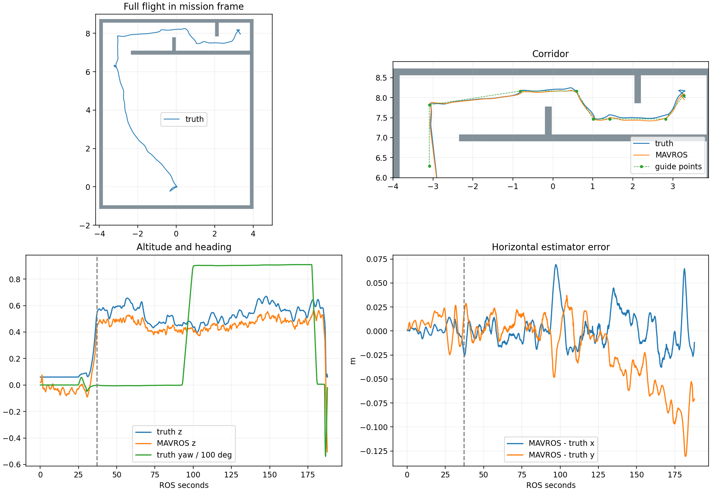
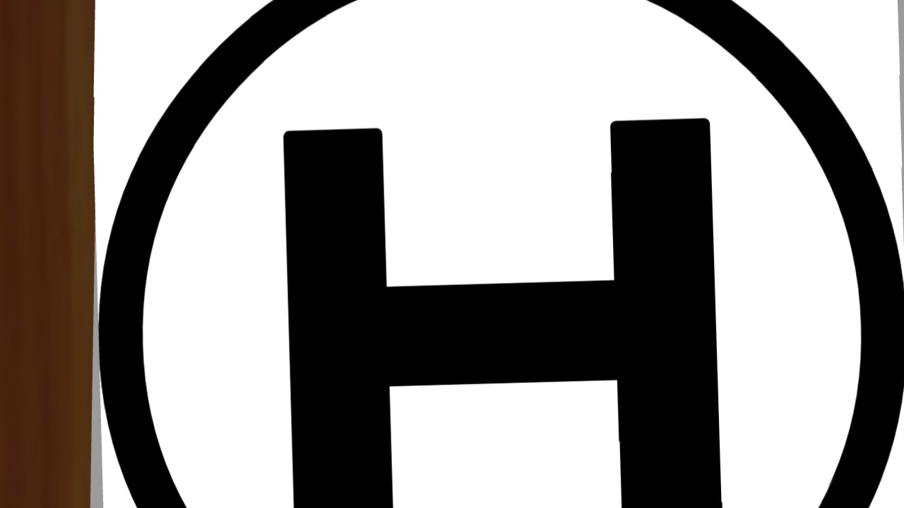

# R59 单轮走廊—降落专项

## 本轮最终结果

仅运行了授权的一轮，已完整收尾、零残留，未重跑或启动十seed。实际源码`e633a9b`，run为`r2026_r59_corridor_landing_20260908_003224`。

**走廊8/8航点、两处0.80m通口完成；低空H有效检出并完成对准，AUTO.LAND生效且实际触垫。原始整轮Gate为FAIL（22/31），最终ON_GROUND/disarm尚未确认。** 原始结果保留，不改判整链PASS。

| 观察项 | 结果 |
|---|---|
| 入廊、8个航点与两道短墙 | 全部完成，通行阶段无障碍接触 |
| 两通口通过时实际高度 | 0.5687m、0.4842m |
| 全程实际最高机体高度 | 0.6701m，低于0.70m；越界/超高均0 |
| H检测 | 有效映射H，最近记录相对标记中心误差约0.071m |
| H对准 | 184.800 ROS s完成10帧稳定对准 |
| AUTO.LAND | ROS日志185.772s确认；PX4状态185.797s转AUTO_LAND |
| 实际触垫 | 186.821s，机体相对H中心约0.116m |
| 最终落地/解锁 | 日志结束时仍armed，landed标志未成立；不能声称完成 |

### 为什么触垫被判FAIL

接触对只有`base_link_inertia_collision ↔ landing_h_clone::link::collision`。终点`landing_h_clone`与起点`landing_h`都引用同一个5mm厚的平面H模型，但此前评测只把起点名称列为地面，漏了终点克隆名称。正常落地支撑触发了“障碍碰撞”错误，required Gate退出后包装器关闭了仿真，末端状态链未完成采集。

这个评测遗漏是本次准备中的错误。已经补齐终点平面标记分类，并新增回归确保墙体碰撞仍被保留；修改不改变物理碰撞形状/响应。修正后45项Gate相关回归通过，**没有再飞一轮**。见[分类修正说明](contact_classification_correction.json)。

PX4 ULog记录到187.817s，末尾仍为armed/AUTO_LAND，landed=false；这不是已经完成disarm但ROS漏报的证据。因此即使去掉错误的地面碰撞计数，也不能补造最终完成状态。

入口`navigation_corridor_landing_vcl06.launch`使用已有post_delivery任务与评测模式，投递计数保持0。本次不代表整场三投验收；R56、R57/0.85m成功基线和main保留，未将本轮FAIL合入main或发布失败全量Release。

## 去年如何检测H

原机载`top_level_scripts/vision.sh`实际启动`patrol_control/landing_detector_node.launch`。其`landing_detector_node.cpp`使用灰度、自适应阈值、形态学、轮廓椭圆拟合，按长宽比和半径选最大合格轮廓，再发布`/detect/land_mark_point`。它没有识别内部H字形，也没有当前的外圈填充率检查。代码把图像缩放为640×512，使用写死的1280×1024内参及旧TF换算。

因此此前“低空看不全1m外圈，所以无法参考去年降落方式”的表达过宽。低空不一定要依赖完整外圈；但不能直接搬运旧的硬编码内参、旧坐标和普通黑圈判定。

## 最小改动

1. 保留现有完整外圈＋H结构检测优先路径。增加默认关闭、专项显式启用的H笔画补充：必须看到两条平行笔画、两侧内凹和一条连接横画。外圈或笔画外端可被裁切，中心由内侧笔画边缘和连接横画计算，不采用被裁切外接框的中心。
2. 使用现有CameraInfo、图像时间戳和映射链；不新增检测话题或控制桥接。原搜索/投递阶段的landing模式门控保持。
3. 独立低空专项配置：走廊目标0.45m、H取景0.50m、Planner虚拟顶界0.55m、规划指令高度上限0.50m，独立真值Gate限制实际机体参考点高度≤0.70m。降低名义值用于给已有高度偏差留余量，不修改传感器噪声或真值。
4. 跟随前视/位置指令步长由专项配置设为0.15m；保留Planner原1m/s搜索动态参数，避免重新调整已有搜索算法。到点距离0.12m、速度阈值仍0.20m/s、连续0.80s。局部目标调整最大0.10m，仍围绕原点、不改高度。
5. 在两墙之间加入一个横向对齐点，形成8个投后航点；保持1.50m总宽、严格0.80m通口、机架尺寸、相机外参和现有接触评测。参考去年低空关键点/停稳方式，不盲目复制用途不明的0.15m反复升降。

现有降落控制仍需真实视觉结果连续稳定10帧才锁定落点，再下降至0.30m，于0.40m交给AUTO.LAND；本次未修改旧控制器或Servo实现。

## 离线检查

- 整机Catkin编译通过。
- 3项H几何C++回归、44项通行/任务Gate回归通过，无额外ROS/Gazebo试飞。
- 93张有中心真值的合成正例通过，包含读取实际CameraInfo的畸变与倾斜相机投影，最大中心误差5.49px；7张圆圈、十字、U形、矩形等负例均拒绝。
- R57成功轮保留的低空H真实Gazebo画面可检出。它没有人工精确中心真值，不将该图的算法对照误差当成实测定位误差。
- 另有25个裁切/朝向边界输入仅用于观察，不计入正负例通过数。
- 航点直连的静态墙面中心净空最小0.40m；这不替代动态轨迹及实际接触验证。
- 所有验证为离线数据/静态launch展开，开跑前仿真启动数0。

详见[开跑前预检快照](preflight.json)、[原始Gate](run/gate_status.json)、[PX4与触垫分析](run/outcome_analysis.json)。本轮阶段结果如上，不宣称整轮PASS。

## 历史图像说明

下图是R57成功轮保存的低空H画面，用于本次算法离线对照，**不是R59本轮截图**。R59的一次只读图像抓取发起时ROS已经停止，未获得新截图，未因此重开仿真。

