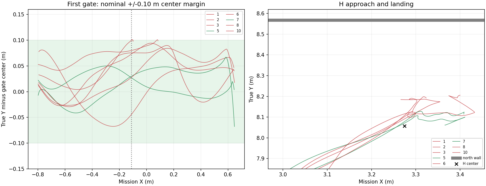

# 十 seed 失败分析与后续最小修复方向

先导 seed 11 完整 PASS，冻结版本十组中仅 seed 5、7 完整 PASS；**2/10 全流程、8/10 三投完成、6/10 走完投后 9 点和两处通口**。本轮统计到此结束，不增加补跑，不改变旧结果，不把该候选合入 main。

八次失败中六次是实际碰撞、两次是投递事务失败。每组原始 Gate 的其它未满足检查多为提前结束的结果：例如未完成落地/解除武装、完成耗时为空，不等于另有八个根因，也不等于实际超过600秒。所有组的单一Planner目标发布者、消息关联/不重复投递等现有检查没有表现为首个故障。

## 1. 第一通口：seed 2、3，横向总误差耗尽单侧10cm余量

名义门中线Y=8.167690，外侧墙内表面Y=8.567690，当前90°机架静态横向包络约0.60m，名义单侧余量约0.10m。

| seed | 真值中心Y | 飞控估计Y | 指令Y | 指令偏离名义中线 | 跟踪偏差（估计−指令） | 定位偏差（真值−估计） |
|---:|---:|---:|---:|---:|---:|---:|
| 2 | 8.268015 | 8.204960 | 8.189198 | +2.15cm | +1.58cm | +6.31cm |
| 3 | 8.267360 | 8.202033 | 8.192587 | +2.49cm | +0.94cm | +6.53cm |

三项叠加接近10cm，护圈在第一通口附近接触Wall_9；并非目标没发布，也不是H检测失败。接触ROS时间分别251.714、286.568s。表中位姿由10Hz记录插值，具体碰撞以Gazebo接触事件为准，不把插值当作毫米级实测。

**后续方向（尚未实施/验证）**：在门前稳定航向和速度后执行短直线通行，减少B样条在短窄段内的侧向弯曲/反复重规划；结合当前雷达局部墙面测量修正相对通口位置，不能仅依赖累计全局位置。横向总误差预算要覆盖定位、跟踪、机架姿态，而不是仅用0.30m膨胀当作完整余量。不能通过放大门洞、缩小护圈或删墙点解决。

## 2. H阶段：seed 1、6、8、10，转向/着陆过程的机架扫掠空间不足

- seed 1、8、10在LAND交接后、AUTO.LAND前，2号桨盘接触同一外侧墙。接触时机体中心Y分别8.18594、8.19466、8.19057，航向约38.34°、13.42°、43.40°；不是保持走廊90°直行姿态。
- 原LAND交接带默认0°航向，机体从90°转回0°。桨盘随转向扫过的外廓不同于0.60m定向通行包络；叠加约10–13cm的Y定位偏差，即使最后航点已被判定到达，也可能擦墙。
- seed 6已经在285.802s进入AUTO.LAND，287.187s、实际高度约0.106m时1号桨盘擦墙，尚未确认落地/解除武装。该组低空末端飞控估计与真值明显分离，接触附近估计z约−0.331m、实际z约0.106m；应结合飞控融合/落地过程继续核查，不能把它简单归结为同一种H图像问题。

**后续方向（尚未实施/验证）**：LAND保持当前走廊航向，或先在确认有完整扫掠净空的位置转向，再进入视觉下降。现有H笔画算法已有旋转正例，不应仅为继承默认0°而在墙边强制转身。H对准后仍须保留落地过程的横向定位/墙距检查；仅“已看到H”不等于整个机架有足够净空。seed6的落地估计异常需要独立确认原因。

## 3. seed 4：外部投递模式丢标后误退回旧航点(0,0)

第二靶bridge的目标地图点约(0.368,4.543)，真值中心(0.3793,4.5667)。165.252s接管对齐；目标仍被观察到168.898s附近，随后圆环/目标标志失效，控制器持续输出`no valid circle : adjust_target_position: 0.00, 0.00`，实际飞回起点附近。250.309s才因`alignment_evidence_deadline_reached`结束，第二槽未投出。

源码`patrol_control.cpp::WayPointDetectDone`第一次进入外部模式时已保留外部目标，但后续`have_waypoint_mark == false`的分支仍无条件回退`waypoint_list[waypoint_next]`。当前该表只有起飞点(0,0)，因此这是实际的旧模式回退漏洞。R60在该文件只增加参数缓存读取，未新改该分支；单个seed之前没触发，不能说明漏洞不存在。

**后续最小修复方向（尚未实施/验证）**：外部模式丢标时保持本次事务已确认目标/当前安全位置并重捕，不能引用旧固定航点表；保留有限超时及“不确定时不投”的行为。圆环短时失效的图像原因本轮未录完整图像，不能据此编造视觉唯一根因。

## 4. 搜索端点与剩余目标可达性：seed 1、9

seed1在搜索端点(1.993,4.473,1.40)消耗两次90s运动期限后才推进，最终完成三投，后续因H擦墙失败。268.354s冻结地图显示该端点被有竖向结构支持的附加绕障柱占据；0.15m邻域没有自由栅格采样点，最近自由采样偏移约0.158m。自由栅格不等于已验证轨迹，不能仅凭这条距离宣称把参数增大就必过。

seed9也曾在该搜索端点停滞，之后339.401s按剩余时间选择tent，目标约(1.171,1.507,1.60)；持续kinodynamic搜索失败，没有进入ALIGN，433.031s目标运动到期，任务以`target_action_timed_out_uncertain`失败，共两投。现有日志确定了失败阶段，但局部裁片不足以唯一解释这条新目标路径的全部搜索失败原因。

**后续方向（尚未实施/验证）**：搜索覆盖点应允许基于可达自由空间调整/略过，并维护实际覆盖补偿；搜索与窄门不能共用同一个很小的端点偏移要求。持续被占据时应尽早识别并调整调度，避免相同目标用满两次90s；新候选接近失败也应在剩余比赛预算内选择可达候选，而非耗尽全部时间。不得把任意未到达点伪装为已覆盖。

## 本轮能确认与不能确认的事

- 八组进入走廊的实际最高机体高度均≤0.70m，最高约0.6839m；低空阶段交接本轮未成为首个失败。
- 三投完成8/10不是稳定三投，更不是整场稳定通过；全流程2/10的样本不足以支持比赛放飞。
- 先导与seed5/7的真实PASS保留；失败均保留原始Gate和轻量分析，不发布失败全量Release。
- 本轮冻结飞行源码不再改、不追加仿真；main仍保留R56历史验收。这不表示R56已经对本次严格0.80m场景或十seed通过。

机器可读详情见[failure_analysis.json](failure_analysis.json)，逐组目录保留实际接触事件。下图比较第一门及H附近真值轨迹，颜色按最终完整Gate结果区分，不能把“在该局部未撞”画成整场PASS。

