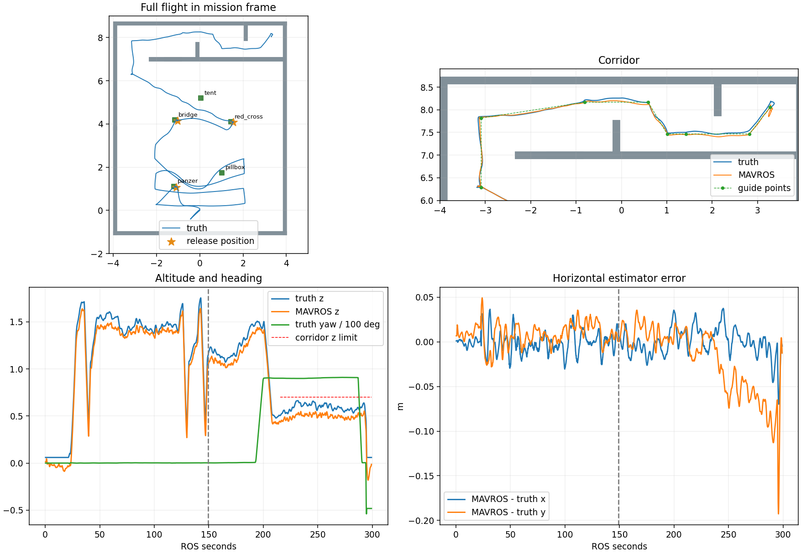

# R60 完整 Gate 与十 seed 全场实验

完整先导轮 **PASS 37/37**，随后同一源码十 seed：**2/10 PASS**。先导轮 seed 11 单独列出，不混入十组成功率。所有原始结果保留；全文不是实机验收声明。

## 完整 PASS 记录

- 实跑源码 `9cfb3e56b11af23b4bc764b48e53454b32d015dc`，入口 `navigation_horizontal_search_vcl06.launch`，Gate scope 为 `full`。
- 先导 run：`r2026_r60_full_pilot_seed11_20260908_011243`；三投顺序 panzer → bridge → red_cross，三次恢复，投后 9/9 航点，入口及两处严格 0.80 m 错列通口按顺序完成。
- 任务耗时 **269.748 ROS s**；走廊实际机体最高 **0.6633 m**；落地中心距 H 中心 **3.98 cm**。
- AUTO.LAND / ON_GROUND / disarm 的 ROS 时间分别为 **294.554 / 296.555 / 298.557 s**。这些是仿真时钟读数，任务耗时从 Mission Manager 启动时计算。
- 零碰撞、零越界、零超高，包装器退出 0，收尾检查无 ROS/Gazebo/PX4/RViz 残留。没有全场 bag。

[原始 Gate](pilot/gate_status.json) · [运行摘要](pilot/summary.json) · [飞行事件与飞控落地分析](pilot/flight_detail.json) · [飞行图](pilot/flight_analysis.png)

廊外先高位到点再原地下降，之后才启用 0.55 m 规划顶界/0.50 m 指令顶界。首门截面中心偏离名义门中心约 9 cm，说明窄口余量仍敏感。走廊真值高度减飞控估计高度 P50 为 9.46 cm、P95 为 14.08 cm；不能简单把名义航点设成 0.65 m 就承诺实际 ≤0.70 m。

## 十 seed：冻结版本与完整分母

固定世界、墙/树/机架/相机和飞行参数，只更换合法靶标位置与朝向；使用 seed 1–10，与先导 seed 11 不重复。实际布设签名不同数为 **10**。没有中途改飞行代码、失败补跑或筛掉失败。

| seed | 完整 Gate | 投递数 | 投后航点 | 任务 ROS s | 走廊最高 m | 落地偏差 m |
|---:|---|---:|---:|---:|---:|---:|
| 1 | [FAIL](seed_01/gate_status.json) | 3 | 9/9 | -- | 0.627 | -- |
| 2 | [FAIL](seed_02/gate_status.json) | 3 | 4/9 | -- | 0.649 | -- |
| 3 | [FAIL](seed_03/gate_status.json) | 3 | 4/9 | -- | 0.627 | -- |
| 4 | [FAIL](seed_04/gate_status.json) | 1 | 0/9 | -- | -- | -- |
| 5 | [PASS](seed_05/gate_status.json) | 3 | 9/9 | 254.96 | 0.674 | 0.146 |
| 6 | [FAIL](seed_06/gate_status.json) | 3 | 9/9 | -- | 0.661 | -- |
| 7 | [PASS](seed_07/gate_status.json) | 3 | 9/9 | 247.45 | 0.670 | 0.091 |
| 8 | [FAIL](seed_08/gate_status.json) | 3 | 9/9 | -- | 0.684 | -- |
| 9 | [FAIL](seed_09/gate_status.json) | 2 | 0/9 | -- | -- | -- |
| 10 | [FAIL](seed_10/gate_status.json) | 3 | 9/9 | -- | 0.649 | -- |

观察成功率 2/10；Wilson 95% 区间约 **5.7%–51.0%**。这只是该固定仿真条件下十种布设的有限样本，不代表任意障碍布局、风扰或实机可靠率。

- seed 1：FAIL；原因 `actual_collision`，记录错误 `['actual_collision']`。详见该组 Gate 和飞行分析，未追加重跑或用成功替换失败。
- seed 2：FAIL；原因 `actual_collision`，记录错误 `['actual_collision']`。详见该组 Gate 和飞行分析，未追加重跑或用成功替换失败。
- seed 3：FAIL；原因 `actual_collision`，记录错误 `['actual_collision']`。详见该组 Gate 和飞行分析，未追加重跑或用成功替换失败。
- seed 4：FAIL；原因 `manager_failed`，记录错误 `['manager_failed']`。详见该组 Gate 和飞行分析，未追加重跑或用成功替换失败。
- seed 6：FAIL；原因 `actual_collision`，记录错误 `['actual_collision']`。详见该组 Gate 和飞行分析，未追加重跑或用成功替换失败。
- seed 8：FAIL；原因 `actual_collision`，记录错误 `['actual_collision']`。详见该组 Gate 和飞行分析，未追加重跑或用成功替换失败。
- seed 9：FAIL；原因 `manager_failed`，记录错误 `['manager_failed']`。详见该组 Gate 和飞行分析，未追加重跑或用成功替换失败。
- seed 10：FAIL；原因 `actual_collision`，记录错误 `['actual_collision']`。详见该组 Gate 和飞行分析，未追加重跑或用成功替换失败。

[批次原始状态](matrix_status.json) · [统计口径](matrix_statistics.json)。逐组目录附原始 Gate、靶标布设、飞行详情和图表，原始 TXT/JSONL/CSV/ULog 留在对应 WSL run 目录。

完整根因分组、证据与尚未实施的修复方向见[十seed失败分析](FAILURE_ANALYSIS.md)。

## R56 后改了什么、为什么

详见 [逐阶段修订说明](REVISION_NOTES.md) 和 [逐文件/提交/参数清单](revision_inventory.json)。R56 原完整 PASS 和 R57/0.85 m PASS 均保留；R57/0.80 m、R58 失败及 R59 未确认落地的原始 FAIL 不改写。

本轮新增的是明确阶段交接与全走廊高度评测，保留搜索/三投策略、Planner 搜索范围、物理机架和严格通口。R59 的 H 补充在原检测器内部，保留 CameraInfo/TF 和原消息输出；没有把 Gazebo 真值送进控制来通过。

## 参数与记录

- [初始运行参数](pilot/rosparams.yaml)、[廊外返程参数](pilot/rosparams_return_staging.yaml)、[低空切换后参数](pilot/rosparams_low_corridor.yaml)。
- [实际 CameraInfo](pilot/actual_camera_info.json)、[八项 PX4 参数读回](pilot/px4_parameters_readback.json)、[冻结运行配置](pilot/scenario_inputs/runtime.yaml)、[控制配置](pilot/scenario_inputs/control.yaml)、[规划配置](pilot/scenario_inputs/horizontal_planner.yaml)。
- 构建通过，239 项任务/执行/Gate 回归通过，launch 展开验证完整 scope 和分阶段配置。H 几何的既有三项 C++ 单元测试及合成/历史图像结果见 [R59 报告](../r59_corridor_landing/REPORT.md)。
- 本轮日志位置仍为 WSL 项目 `logs/`，没有写到其它盘；全场 bag/录屏关闭。失败轮次不发布全量日志 Release。

## rqt 三版计算图

[打开三版切换页面](topology/index.html) · [完整](topology/rqt_graph_nodes_only_full.svg) · [核心](topology/rqt_graph_nodes_only_core.svg) · [仅飞行运行链](topology/rqt_graph_nodes_only_flight.svg)。由本轮先导 PASS 保存的 ROS Master 注册数据调用已安装的 `rqt_graph` 后端生成，模式 `Nodes only`：椭圆为节点，边文字为 ROS 话题，箭头沿发布→订阅。服务没有伪装成话题。

完整 34 节点；核心 30 节点/44 话题；仅飞行 23 节点，排除仿真世界/布设/评测/记录/mock 与仿真启动辅助。仅飞行图是本轮真实节点的筛选，不虚构未启动的硬件驱动。实机应用入口静态展开为 22 节点，另由外部 MAVROS 和设备驱动提供输入；仿真 target_detector 在板端由 target_detector_rknn 替代。节点连接不证明板端实时性能。

## 竞赛前剩余工作

现场坐标/高度零点、真实相机/RKNN 持续实时链、机械 Servo 带载执行与落点、遥控接管/急停、真实雷达/护圈遮挡和分级低空试飞仍需完成。当前记录来自笔记本 SITL，未执行实机动作，不能宣称已经是比赛级实机可靠性验收。

本轮按2/10结果收口，不追加仿真，不合入main。main仍为R56历史验收31d0b2a；本次功能源码、完整PASS记录及十seed分析推送到保留的功能分支。成功归档与推送清单见CLOSEOUT.md。硬件入口保留此前配置，未把本轮未通过鲁棒性验证的低空候选设为实机默认。
