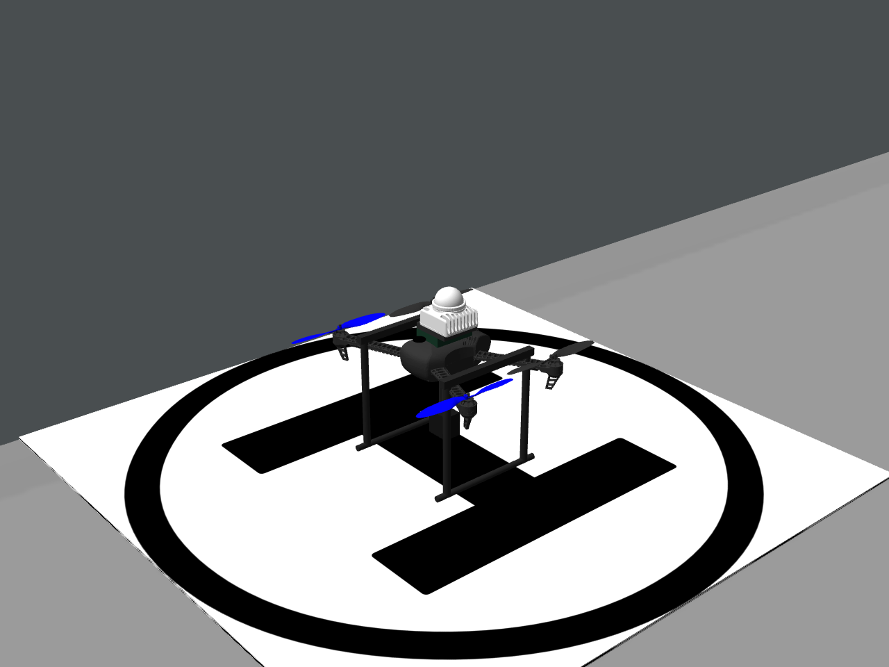
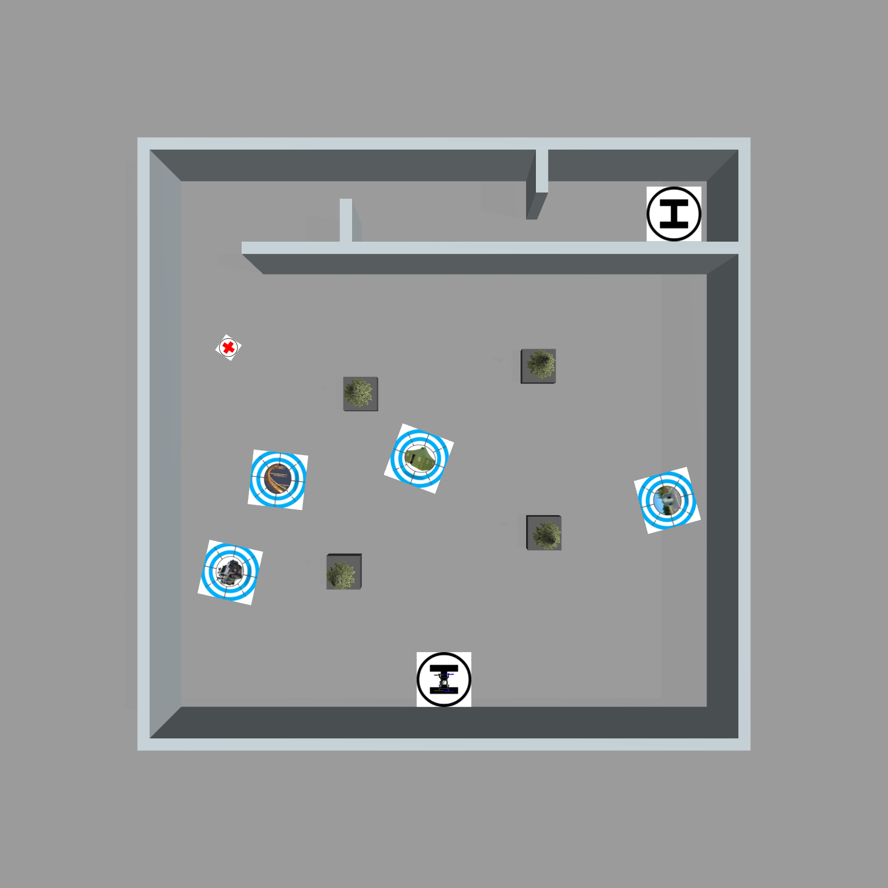

# R61交付报告：装配、场地、规则与搜索预筛

2026-09-09。**本轮完成源码修复、整机构建、静态Gazebo场景与离线策略比较，没有启动新飞行，不产生新的全场PASS。** R60历史先导37/37 PASS、十seed2/10完整通过保持原结论；main仍为R56验收。

## 机体、相机、雷达为何看起来分离

此前把通用iris外形、MID360的CAD网格原点和实测传感器原点直接拼在一起：机架缩放后外形原点仍不对应飞控；雷达外壳与机体相交；相机及起落架可见支杆未接到机身。这是模型装配处理错误，不是用户16/21cm数据矛盾。

修正中把通用chassis参考放到FC下4cm，只将MID360外壳的visual/collision局部上移4cm，补齐支架与横梁。两项4cm是通用网格装配假设，不是新增实测外参。FC/相机/IMU测量坐标保持独立，未靠挪动传感器来让外壳看起来连接。

[侧视原图](new_seed11/aircraft_side.png) · [Gazebo实时位姿与截图状态](new_seed11/preview_status.json)。截图为原生Gazebo静态相机输出，未绘制或生成替代飞机图。

| 量 | 最终值 | 来源/验证 |
|---|---:|---|
| 相机在FC下方 | 0.16m | 用户最终确认；GetLinkState读回一致 |
| 相机在MID360 IMU下方 | 0.21m | 用户确认；实时IMU组合坐标读回一致 |
| 光心落地离支撑面 | 0.06m | 用户确认；5mm H垫上实时读回一致 |
| FC/IMU落地离支撑面 | 0.22/0.27m | 由上述三项推导 |
| 实机长×宽×高 | 0.50×0.50×0.37m | 用户提供 |
| 仿真保守包络 | 0.55×0.55×0.40m | 适当放大；FC系z=[−0.22,+0.18] |

最终静态场景FC世界z=0.225、光心0.065、IMU0.275；扣除H垫表面0.005，镜头恰为0.060m。雷达link原点不等于IMU原点，不能用link外壳坐标直接减出安装距离。

通用载体几何缩放0.70、质量/惯量/推力参数仍为通用iris值，电机力臂随几何改变。**新模型不是实机CAD或已标定动力学，也不能沿用旧机架飞行PASS证明新动力学。** 支架示意负责可见装配，保守外层碰撞体覆盖整机外形；其对雷达射线不可见的旧建模约定仍保留。真实自遮挡/振动须实测。

## 新地图与seed11

以会议允许的较保守情况建模：内净9.6×9.6m，外围墙厚0.20m、外圈10×10m。内边界X=[−4.8,4.8]、Y=[−0.5,9.1]；北侧通道宽1.50m、墙高1.50m，入口1.50m。两处错列通口严格0.80m，墙面X=−1.6/+1.6，开口中心Y=8.7/8.0。

起飞H中心(0,0)、半径0.50m，外缘贴南侧内边界。降落H中心(4.2,8.5)、半径0.50m，北/东外缘距墙各0.10m。用户要求的10cm是**H外圈至墙**，不是飞机机体至墙；飞机实际净空还受定位、姿态和外形影响。

靶标原始采样域扩大为X=[−4.8,4.8]、Y=[−0.5,7.6]，共77.76m²。保留靶板完整在场内、板间间隔、不与四组树箱/H重叠；删除旧bigbox造成的受限区域。树冠极端重叠仍排除。四棵树放在0.60×0.60×0.30m箱体上，总高约1.5m；箱体尺寸与固定树位置是仿真假设，不是会议给出的精确尺寸。

| seed11靶标 | X(m) | Y(m) |
|---|---:|---:|
| tent | −0.457156 | 4.034160 |
| pillbox | 4.072420 | 3.271770 |
| bridge | −3.027260 | 3.646460 |
| panzer | −3.896410 | 1.957550 |
| red_cross | −3.929560 | 6.058120 |

朝向及原始生成记录见[random_field_truth.yaml](new_seed11/random_field_truth.yaml)。固定seed不保证换场地后位置仍与R60相同，场域和拒绝条件改变即会改变随机序列接受结果。

## 高度、航路与碰撞判定

以落地FC为local_z=0时，ground_z=−0.22，AGL=local_z−ground_z。全场候选配置按此换算，保持预期物理高度：

| 阶段/阈值 | local z(m) | FC AGL(m) |
|---|---:|---:|
| 搜索/廊外高点 | 1.18 | 1.40 |
| 靶标取景 | 1.38 | 1.60 |
| 廊外下降点 | 0.18 | 0.40 |
| 走廊航段 | 0.23 | 0.45 |
| H取景/低空指令上限 | 0.28 | 0.50 |
| 低空规划上限 | 0.33 | 0.55 |
| H末端下降 | 0.08 | 0.30 |
| AUTO.LAND高度条件 | 0.18 | 0.40 |
| 全局指令/规划上限 | 2.08 | 2.30 |

走廊9点按新地图重布：[(-4.05,6.7,1.18),(-4.05,6.7,0.18),(-4.05,8.35,0.23),(-2.3,8.7,0.23),(-0.9,8.7,0.23),(0,8.0,0.23),(0.9,8.0,0.23),(2.3,8.0,0.23),(4.2,8.5,0.28)]，z均为local。门开口仍为固定名义几何，并未实现未知开口识别。

释放hover_height=0.10、许可max_height=0.30仍使用原local定义；不把其直接标成AGL。搜索间距0.70m、跟随步长0.15m、常规到达0.12m/停稳0.80s/速度≤0.20m/s、Planner max_vel/max_acc=1/1、栅格0.05m、XYZ膨胀0.30/0.30/0.10m、净空0.025m沿用。现场坐标旋转/平移按用户要求届时配置，必须同步位置、航向、地图/高度零点。

Gate新增带默认值的ground_z换算，让物理限高在新零点下保持意义；未放宽碰撞、0.70m走廊实际高度或落地标准。Gazebo接触/真值只在仿真评测链，硬件launch不启动它们。硬件入口虽然已改16/21cm外参与ground_z，但仍加载此前runtime/control，不自动切换新航路；其搜索1.40local等旧参数不能称为1.40AGL，部署前须整体选配和复核。

## 丢标回退漏洞

旧`WayPointDetectDone`在标准靶蓝环丢失时无条件读取`waypoint_list[waypoint_next]`，外部任务模式可能因此回到旧(0,0)。最小修复：仅旧独立模式使用旧航点；外部模式保留当前事务的对准目标XY/Z/yaw以重捕获。不新增节点、接口或协议，不修改红十字已有保持逻辑。

测试直接抽取生产if/else编译C++14/UBSan，覆盖连续丢标、空旧表、重新检测、新事务切换与旧独立回退。该回归对旧源码失败、修复后通过。保护快照保存在main集成来源与导航分支legacy_baseline/20260908_r61_external_alignment，精简分支不重复装旧参考。

## 历史11张布局和轻量搜索

R60实际seed1–11全部展示：[总览](all_seeds_overview.png)、[11页PDF](all_seeds_individual.pdf)、[逐张图](layouts.html)、[55靶坐标CSV](target_coordinates.csv)。它们使用冻结的旧world，不以新9.6m地图改写历史记录。

[轻量比较报告](SEARCH_COMPARISON.md)及[四组JSON/CSV](search_comparison/)已经完成。旧场地的北先优势在更广出生范围下消失；当前更值得验证可达X覆盖端点，Y航线受固定机头的相机短边限制，自由区间方案覆盖较好但更费时。只做离线几何预筛，没有替换整机策略，更没有新增十次飞行。

## 验证与交付边界

- 整机Catkin构建通过；240项任务/执行/Gate回归通过；轻量仓53项测试通过；生产分支的丢标回归新通过/旧失败。
- SDF语法、几何/外参静态检查通过。早期[preflight.json](preflight.json)对应初版几何检查；最终装配以new_seed11/preview_status.json实时读回为准。
- 最终静态预览run：`logs/r2026_r61_seed11_final_preview_20260909_000031`，CAPTURED、退出0、收尾PASS；先前三次静态展示亦已收尾。没有PX4/MAVROS/任务飞行，0bag。
- 机载/仿真两份本地源码包、模型依赖与使用边界见[打包与部署](../../BUNDLES.md)。远端feature保留，不更新main验收。

## 比赛仍需完成的事项

[会议规则校正](../../competition/RULES_20260906.md)优先：正式五个静态随机目标，取消tank/移动靶；不强制桨保；箱+树是四组障碍；内部门严格80cm且开口未知可左右/居中调整。历史PASS不代表这些条件都已覆盖。

优先补齐随机门开口在线定位/航点生成，赛前调整后的目标/门缓存与单次启动边界；再验证新几何与回退修复的全场稳定性。实机还需飞控/相机/LIO零点、真实反光和板端并发负载、动力学/控制、带载投递与落点、遥控接管/急停及分级试飞。当前可用于部署联调准备，不能称为拿上飞机即可比赛。

本地双包交付已完成：机载17.5MB、仿真38.9MB，读回/资源检查通过，机载解包后WSL源码整机构建通过；[详细结果](bundle_validation.json)。板端ARM与新全场飞行仍未验收。
