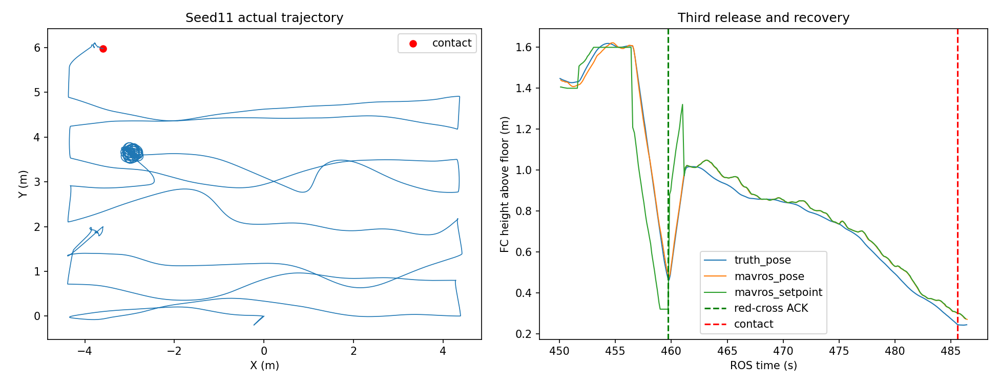

# R62 完整 seed11：三次释放完成，第三投恢复时碰撞

2026-09-09。本轮 **完整 Gate FAIL**；严格按用户约定不启动 seed1–10、不追加重跑。失败轮次不发布全量 release，不合入 main。

## 运行范围与结果

- 运行目录：`logs/r2026_r62_complete_seed11_20260909_040421/`，代码 `aedba0158d538b03845eca2d61f6f620cae1d7ad`。
- 飞行算法、地图、传感器/机架模型与此前 R62 首投成功版本一致。本轮只新增可选的只读 Gate 完整观察模式与矩阵录像参数；默认 Gate 仍保持原来的提前失败模式。
- 完整观察模式保留原错误判据，非终局错误记录后继续观察，600 秒任务时限、落地解除武装或碰撞结束；启动/墙钟看门狗处理无时钟或资源故障。没有触发错误延后掩盖：本轮 Gate 唯一错误为 `actual_collision`。
- ROS 22.668 s 任务开始；ROS 485.561 s 碰撞，即任务开始后 **462.893 s**。这是碰撞终局，不是跑满 600 s，也不是超时。规则的裁判起飞计时与当前任务启动时钟仍需在竞赛部署时统一。
- 自动起飞、建图、搜索巡航、三次 mock 执行回执完成；恢复仅 2/3。未进入走廊、未降落。释放专项 `visual_delivery_audit.status=PASS` **不等于完整 Gate PASS**，也不证明实物落点得分。
- 三槽 raw 调用恰为 `[1,2,3]`，无重复释放；碰撞 1 次，越界 0，限高违规 0；最高实际 FC AGL 1.749 m。

| 靶标/槽位 | 接近指令 ROS s | 释放回执 ROS s | 接近至回执 | 回执至恢复 |
|---|---:|---:|---:|---:|
| panzer / 1 | 99.515 | 107.070 | 7.555 s | 35.820 s |
| bridge / 2 | 216.518 | 323.759 | 107.241 s | 5.366 s |
| red_cross / 3 | 451.213 | 459.713 | 8.500 s | 未完成，25.848 s 后碰撞 |

此表使用轻量记录器接收时刻；panzer 代理原始回执 stamp=107.055 s，15 ms 差异不是第二次释放。[结构化分析](analysis.json)、[阶段事件](stage_events.json)、[Gate](gate_status.json)。

## 失败原因：投后恢复交接不一致，加上随位置移动的“保持”指令

1. red_cross 在 459.713 s 已成功释放，随后确实开始爬升，并非 ACK 丢失。
2. 461.103 s，`CrossDetectionDone()` 读到 MAVROS local z≈0.74 m，超过当前控制配置 `uav_vision/recovery_height=0.73`，清理投递状态。`externalMissionTick()` 切到 Run_point、关闭对准，等待下一任务。[控制日志](handoff_excerpt.txt)
3. `navigation_planner_bridge._update_recovery()` 要求的是 `target/recovery_height=0.95` local，并要求 Run_point、对准关闭及 0.5 s / 0.15 m 稳定窗口。控制层已退出爬升，而桥还不能确认恢复，因此没有发下一条 RESUME/投后路线。`.73` 是交接阈值，不能误说成整段恢复目标；红十字内部原爬升目标为 1.15 local。
4. Run_point 会接收仍在持续发布的规划设定值。`traj_server.cpp` 在距旧轨迹超过 `target_dist+0.05` 时，将设定位置替换为**每次收到的当前里程计位置**。它不是固定空间位置的悬停目标。日志显示 461.153 s 已重新接受这些命令；462–485 s，规划设定值与当前 MAVROS 位置差的中位数仅 0.69 mm、P95 2.39 mm。[数据](recovery_hold_error.json)
5. 结果是高度参考随实际下降一起降低：实际 FC AGL 从约 1.02 m 降至碰撞附近 0.245 m；碰撞对为 `competition_guard_collision` 与 `random_red_cross::link::collision`。[实际接触](gazebo_contact_status.json)

**已证实的故障链是：恢复交接阈值不一致 → 爬升控制过早结束 → 旧规划输出重新接管且目标跟随当前位姿 → 持续下降并碰靶。** 初始下沉中动力学、速度和飞控融合各自的贡献尚未做因果隔离；不能仅凭这一轮把全部下沉归因于某一个参数。但无论这些扰动来源如何，投后保持不应追随漂移，也不应依赖惯性越过另一层恢复阈值。

这属于实机共用控制/规划链的风险，不是单纯 Gazebo 显示或点云稀疏。不能通过忽略红十字接触、缩小机架、降低 Gate 标准或继续依赖爬升过冲解决。旧 R62 部署包尚包含这一行为，应视为待修复测试包，不是可直接放飞的验收包。本轮只分析，不擅自修改飞行代码。

## 第二投为什么慢

bridge 规划接近在 221.091 s 已确认到达，221.105 s 开始视觉捕获；直到 319.811 s 才出现严格对准上下文有效事件，耗时 **98.706 s**，之后约 3.948 s 得到释放回执。因此主要延迟发生在视觉捕获/对准，而非规划器耗费 107 s 才到达目标。

250 s 原始相机画面中，靶标明显偏在画面下方，外圈底部被裁切；实际轨迹在该处有持续小范围绕动。已选中目标的消息持续存在，不能说完全没有识别。现有轻量记录没有逐帧保存所有精修拒绝原因，尚不足以量化“外圈完整性、中心偏差、稳定帧、姿态变化、阈值”分别占多少时间。后续应利用本次视频回放补齐原因统计，再改控制或取景策略，不能直接放宽释放门槛。

[250 s 取景](camera_ros_250.jpg)、[315 s 取景](camera_ros_315.jpg)。第一投投后恢复也有 35.820 s 延迟，与上一轮首投约 37.431 s 现象相近，应与上述恢复交接一起解决。

## 搜索与剩余时间

当前沿用新地图的 24 个覆盖航点，任务中心域 X=[-4.3,4.3]、Y=[0,7.1]，换带 0.7 m；搜索区实际边界 X=[-4.8,4.8]、Y=[-0.5,7.6]。第三投中断时 route_index=16，不能把预设航带覆盖范围当作已经有效观察全场。

机体刚性下视相机，FC→相机 -0.16 m、FC→雷达 IMU +0.05 m，roll/pitch/yaw均影响曝光画面。名义 FC 搜索 AGL=1.40 m，但本轮最高达到1.749 m。后续覆盖与避障评分应按实际轨迹和视场统计，而非名义高度。

第三次回执发生在任务开始后 437.045 s，距 600 s 仅剩约 162.955 s；恢复尚未完成。历史 R60 穿廊至落地曾需 128.924–149.361 s，不能据此保证本次新模型/地图还能及时降落。此次没有走廊时间样本，失败样本不能记成 0 s 加入预算。`early_return_enabled=false` 保持不变；420/180 s 旧预算未启用，450/150 s 新方案也未启用。

## 录像、产物与验证

- 原始相机：`logs/r2026_r62_complete_seed11_20260909_040421/downward_camera.mp4`，1280×720，4043 帧；图像源时间 0.498–486.384 s。固定 10 fps 编码播放长 404.3 s；逐帧 [CSV 位于同一运行目录]，不能以播放秒数代替 ROS 秒数。
- ffprobe 可读取，完整 ffmpeg 解码退出 0：[验证结果](video_decode_check.json)。录像不是桌面录屏；本轮未录全场 bag。
- 关键数据有 poses CSV、事件 JSONL、Gate、参数快照、场景真值和 roslog。原始视频及大日志只留本地，失败不全量发布 release。此目录仅提交小型分析、图片和关键事实。
- 完整观察模式执行了六个终止分支检查（默认错误立即结束、观察模式非终局错误继续、碰撞结束、600 秒结束、失败后落地结束、看门狗结束），脚本及 launch 静态解析通过。检查脚本保存在 `logs/_artifacts/r62_full_trial/check.py`。
- 包装器正常失败收尾，`check_sim_processes.sh` 确认无 ROS/Gazebo/PX4/RViz 残留。本轮后不再运行新仿真。

后续修复与验收顺序见 [搜索/返航计划](../../competition/SEARCH_RETURN_PLAN_20260909.md) 与唯一优先级源 [ROADMAP](../../../VISION_2026_ROADMAP.md)。本轮失败，未触发十 seed 矩阵及其条件性的 R61 全量修订汇总；此前各阶段修订记录仍保留，不能把它们写成本次新成功记录。
