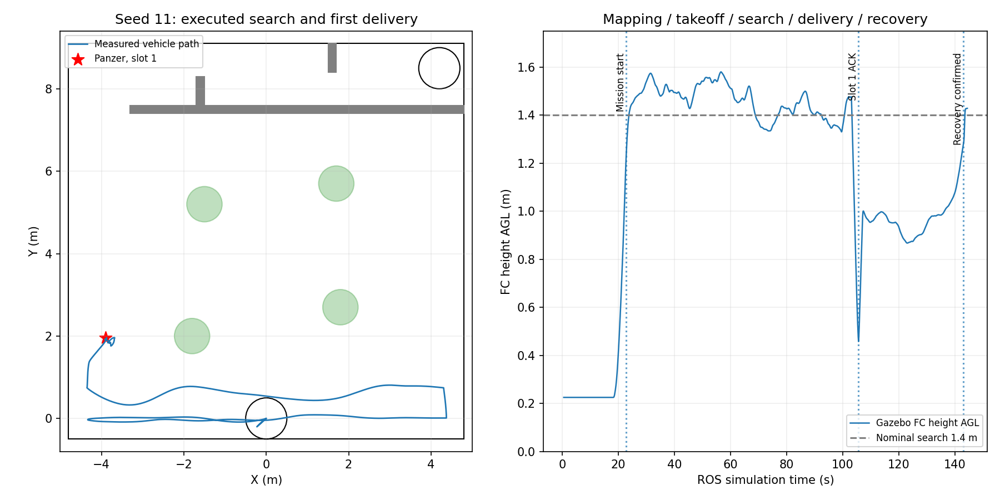

# R62：seed11任务已可运行

2026-09-09。**已实际完成建图、自动起飞、搜索巡航、首个panzer靶的第1槽仿真投递确认，并恢复搜索。** 按用户最新目标在这里主动收尾；不追求、也不声称整场PASS，没有继续走廊/降落或seed1–10。

运行源码`8bedcc0c376b815eb3590e740ee9634210f5c3f5`，run=`logs/r2026_r62_operational_seed11_20260909_030841`。后续提交只补回归/报告/交付材料。

## 实跑证据

| 要求 | 观察结果 |
|---|---|
| 建图 | PointCloud2接通，LIO/FreeDOM持续运行，归档911个LIO位姿样本，地图就绪后任务启动 |
| 自动起飞 | 飞控正常解锁；真值FC AGL在ROS22.110s达到1m；最高1.580m |
| 搜索巡航 | ROS22.848s开始任务，实际沿牛耕航段飞行，真值XY范围X=[−4.351,4.372]、Y=[−0.202,1.962]m |
| 视觉投递 | panzer目标0，第1槽；ROS105.570s返回success=true/raw_actuator_ack，仅一次raw Servo调用 |
| 恢复搜索 | ROS143.001s记录release_recovery_confirmed，随后发布RESUME，任务仍SEARCH、mission_failed=false |
| 接触 | 接触流ready=true，7198个心跳样本，已记录实际碰撞0 |
| 收尾 | ROS144s附近观察到所有运行条件后主动停止，ROS/Gazebo/PX4/RViz残留为0 |

[运行条件](operational_status.json)、[首投视觉/许可/原始服务证据](first_release_evidence.json)、[详细结果](operational_success_analysis.json)、[接触记录](gazebo_contact_status.json)。该投递是既有guarded Servo→仿真mock执行确认，不是机械带载实投或落点得分。

完整三槽visual_delivery_audit保留WAITING，没有改成PASS；完整37项Gate未执行到终点。包装器退出130来自达到本次运行目标后的SIGINT收尾，不是伪造一个全场通过结果。任务运行条件使用单独的operational_status.json记录。

## 相机视频

原生下视话题`/downward_camera/image_raw`，1280×720 MPEG4，1197帧，编码播放119.7s；源图像覆盖ROS0.526–144.399s，逐帧时间在downward_camera.csv。采样不是均匀满帧，不能用播放时间代替ROS任务时间。

本地视频：`logs/r2026_r62_operational_seed11_20260909_030841/downward_camera.mp4`；[解码检查](camera_video_probe.json)。未录全场bag。原始参数、事件、位姿、ULog及匹配run_id的roslog均留在该run目录。

## 解决了哪些问题

1. 新雷达模型误用CustomMsg，恢复为SITL FAST-LIO所需PointCloud2；实机仍用真实驱动CustomMsg，不改其lidar_type。
2. Gazebo实际展开名含iris::/mid360::前缀，按展开结果修正插件引用，恢复接触心跳和包络/自身雷达外壳的射线排除；实体碰撞保留。
3. 保守55×55×40cm包络改为主刚体上的碰撞体，取消微小质量接地支撑关节；主刚体原点统一为FC，合并人工IMU小刚体质量/惯量，保持外形和总质量。
4. 起飞生成高度对齐5mm H垫；新接地包络使用原成功iris主机体的ODE min_depth=0.001/max_vel=0，消除静止时数m/s²的数值接触抖动。其后飞控位置恢复原点附近，健康检查正常通过。
5. 起飞阶段固定XY不再被通用三维距离限幅拉向漂移位置，Z继续限幅；搜索阶段保持原Planner跟随。
6. 按1.577kg、4电机k=5.84e-6和omega=100+1000*u计算悬停输入约0.71338，SITL初值设0.713，保留HTE；避免用0.5初值长时间贴地加推力、积累姿态差动。未改真实飞控参数。
7. 完整Gate边界由旧8m范围改为当前9.6m真实内墙面；仍保留物理碰撞、健康、限高和600秒检查。
8. 按用户明确要求，本批次关闭420秒提前返航与返航预算的选靶限制；单动作超时/错误结束保留。该开关硬件默认true，本次实跑未到420秒，550秒仍允许任务、600秒截止由软件回归验证。

没有通过缩门墙、缩小既定包络、关闭健康/接触检查、用真值定位或修改识别权重来完成任务。

## 新地图与外围点云

场内seed11靶位、四组树箱、左右80cm错列门保持固定，24个搜索航点覆盖X=[−4.3,4.3]、Y=[0,7.1]，0.7m间距、FC名义AGL1.4m。范围对应9.6m内场；本轮只执行至首投并恢复，不声称实际全场覆盖。

外围仅新增简单墙/柱/箱体等17个静态几何link，用于提供点云背景，不做人群或场馆拟真。早期链路修复后的只读点云检查有20000个有效点，范围约0.52–15.58m；不再用空旷世界来代表室内，但也不声称已验证动态观众剔除。[外围说明](indoor_context.json)。场外模型没有把未知靶位或门口真值发送给任务/规划。

## 尚未完成的验收

这次只有一轮首投功能闭环，未证明稳定三投、完整走廊/降落、随机门/树箱泛化或实机可赛。首投ACK到恢复搜索约37.431s，需要后续分析回升、稳定等待和高度基准；当前标准靶释放后源码还会设置align_height=1.2local，uav_vision/recovery_height=0.73local是交接门限，不能误写成整个回升的目标高度，bridge确认门限默认0.95local。

名义1.4m搜索的实测最高高度为1.580m，高度误差与避障计分仍需后续单独验收。机体惯量/动力仍为通用SITL来源，安装尺寸匹配不等于完成真实动力标定。

244项任务/Gate回归、1项实际生产起飞限幅回归通过；另新增4项模型契约回归覆盖实际SDF展开名、点云类型/安装、接地设置和悬停初值，均通过。主/视觉构建通过。main仍保留R56验收，仅更新feature分支。

旧fd147c72仿真包不含这些修复，不能继续当作当前版本；新的本地包与冻结源码索引见[交付说明](../../BUNDLES.md)。硬件入口不加载Gazebo模型/插件，实机仍需设备链、带载和飞行验收。
