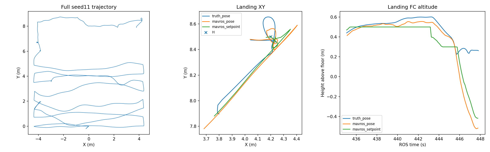

# R63：恢复修复有效，seed11 在 AUTO.LAND 阶段失败

2026-09-09。本次按请求修复已定位的恢复阻塞并运行一次完整 seed11。结果 **Gate FAIL（28/37）**：三投、三恢复、9个投后航点和两门通过；最终自动降落碰墙，未解除武装。不追加仿真、不运行十seed、不合main、不发布失败全量release。

## 修复了什么

飞行版本 `b7c0dd7ccfcfbe36132b8607194b5736fea7148c`。保留新地图、55×55×40cm碰撞包络、相机外参、24点搜索航路、严格0.80m门口、释放许可和碰撞判据，420秒提前返航仍关闭。

1. 控制的恢复交接高度从0.73改为0.95 local，与桥的恢复确认高度一致。其含义为交接阈值；恢复目标仍使用既有控制流程的高度。
2. 对准完成后锁住恢复位置和已有恢复目标高度，等待下一条任务运动命令。持续刷新的旧轨迹不再覆盖这段等待；新任务到来恢复原规划入口。不新增节点、消息或任务管理器。
3. 轨迹偏离时锁存固定空间保持位置，新轨迹到来才重置，修正过去逐帧把当前位姿当保持目标的问题。
4. 更新相关回归，并修复上轮只读观察模式在未启用时仍依赖ROS时钟的单元测试兼容问题。

涉及 `patrol_control.cpp/.h`、`traj_server.cpp`、完整低走廊控制配置、相关测试及只读Gate。旧控制快照在来源分支 `legacy_baseline/20260909_r63_recovery`；精简分支不放旧源码副本。实际Catkin构建、244项ROS任务/Gate回归、2项生产保持逻辑回归及原起飞限幅回归通过。

## 实跑结果与上轮对照

运行目录：`logs/r2026_r63_recovery_seed11_20260909_142702/`。[配置清单](manifest.yaml)、[完整数据摘要](analysis.json)、[Gate](gate_status.json)。

| 项目 | R62失败轮 | R63本轮 |
|---|---:|---:|
| 三次释放回执 | 3/3 | 3/3 |
| 投后恢复 | 2/3 | 3/3 |
| panzer回执至恢复 | 35.820s | 2.747s |
| bridge回执至恢复 | 5.366s | 2.139s |
| red_cross回执至恢复 | 未完成、碰靶 | 2.314s |
| 投后9航点 | 未开始 | 9/9 |
| 两道障碍门 | 未进入 | 按序通过 |
| 最终降落 | 未进入 | AUTO.LAND后碰墙 |

本轮panzer、bridge、red_cross释放时刻分别为ROS103.744、230.944、307.065秒；恢复分别为106.491、233.083、309.379秒。raw调用恰为槽位1、2、3，释放专项PASS；无重复释放。[释放记录](delivery_evidence.json)

bridge从接近指令至释放本轮6.244秒，上轮107.241秒。本轮没有修改视觉阈值或取景算法，不能据此宣称视觉长等待已根治。不同到达姿态和可见性仍需回放与多轮验证。

进入走廊时FC实际AGL约0.421m；第一、第二门通过时分别约0.381m和0.491m，均无接触。第一次门横向坐标8.676m，第二次8.065m。整轮无越界和高度违规，最高FC AGL1.672m。H检测真值位置误差约3.12cm，Gate已确认有效H。

ROS22.828秒任务开始，447.203秒第一次碰墙，任务用时424.375秒。碰撞对是机体包络与 `toudi2::Wall_13::Wall_13_collision`；同一墙发生两次接触事件，第二次在447.287秒。失败不是超时，且未达到ON_GROUND/disarm。[接触记录](gazebo_contact_status.json)

## 新阻塞：AUTO.LAND交接航向跳变及近地估计异常

时间链条已明确：

- 436.617s：9点投后路线完成，进入LAND。
- 443.266s：H对准连续10帧通过并锁定。
- 445.079s：控制服务确认AUTO.LAND切换；随后飞控进入自动下降。
- 445.115s附近：PX4内部姿态目标yaw由1.5708rad突变至3.1284rad（**NED坐标**，约90°→179.2°）。实机航向目标不是只在ROS端设定，模式切换后的PX4内部目标也需验证。
- 446s附近：真实机体已明显转动且接近地面。真实FC AGL约0.262m，邻近MAVROS估计local z约-0.179m；XY也开始显著分离。不能把此时的估计高度当真实AGL。
- 447.203s：真实机体接触走廊隔墙，Gate结束；没有成功落地解除武装。

[控制交接日志](landing_excerpt.txt)、[ULog指令/重置计数](landing_commands.json)、[ULog近地状态](landing_ulog.json)。PX4 ULog与ROS记录分别保留各自采样时刻，表述中的“附近”不作毫秒级强行对齐。

本机PX4源码 `99c4040` 的 `FlightModeManager::switchTask()` 在没有旧FlightTask时，以零初始化的reset counters传给新任务；`FlightTask::_checkEkfResetCounters()`随后比较当前历史计数；`FlightTaskAuto::_ekfResetHandlerHeading()`会把delta_heading加到yaw历史目标。该路径可把进入自动模式前早已发生的重置再次应用。

本轮445秒前后heading_reset_counter一直为1，delta_heading一直约1.5706rad，并没有新的航向重置；内部目标却在AUTO.LAND激活时增加约同样的90°。源码路径与数据共同指向**新自动任务重复处理历史航向重置**。需对“无旧任务→自动任务”初始化路径作专项回归，区分继承旧任务历史和用当前估计建立新任务参考。

近地高度/水平估计分离和落地检测未成立还需分解：不能仅凭上述航向问题就保证修后必落地。碰墙前外部视觉位置/航向融合仍启用、创新未被拒绝；447.8秒后的融合关闭发生在收尾之后，不应倒置成事故起因。本轮没有改PX4源码，保留其现场状态待下一步修复验证。

后续还应保持LAND交接航向连续（本轮廊内航向与LAND目标仍不同），检查模型接地动力学、外部里程计近地漂移、气压计融合与落地检测条件。不能忽略墙体接触、强制解锁状态为已落地或把实机终止动作搬进评测以获取PASS。

## 录像与交付状态

相机录像 `downward_camera.mp4` 留在上述本地运行目录，3804帧、1280×720、固定10fps编码；源图像时间0.468–447.788秒，编码播放380.4秒。源时序以同目录CSV为准，不以播放时间代替飞行时间。ffprobe可读，完整ffmpeg解码退出0：[检查](video_decode.json)。没有全场bag。

关键帧：[第二投](camera_ros_230.jpg)、[第三投](camera_ros_307.jpg)、[第三投恢复](camera_ros_310.jpg)、[H取景](camera_ros_440.jpg)、[下降前](camera_ros_444.jpg)、[近地异常](camera_ros_446.jpg)。

本轮修复已在当前仿真中验证三次恢复和后续航路有效，但整个闭环仍有最后降落阻塞，不能称比赛鲁棒或实机可直接放飞。旧R62部署/仿真包没有自动包含R63源代码修改，本轮没有重新打包或覆盖旧包。修订和报告推送保留分支；main不变。仿真已正常收尾并检查零残留。
