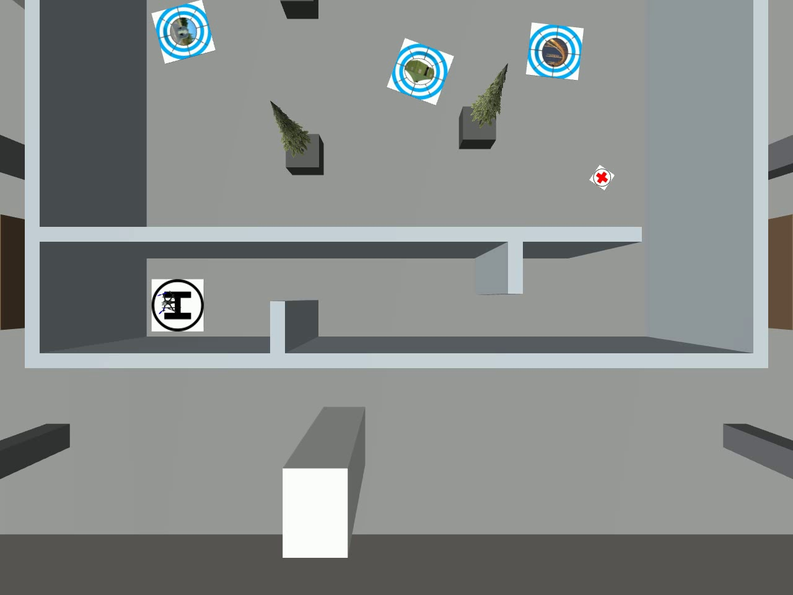

# R64 seed11 完整PASS

2026-09-09。飞行源1983b2f，PX4基线99c4040加仓库deployment/px4_patches补丁。实际Gate 37/37 PASS，任务422.712秒：三投、三恢复、9航点、两门、H对准、ON_GROUND和解除武装，零碰撞/越界/超高。

修复AUTO.LAND激活时重复应用历史EKF重置；没有采用20cm空中停机，没有缩小碰撞模型或放宽Gate。R63恢复修复继续有效，三次恢复约2–3秒。机载相机FC下16cm、IMU下21cm、地面净高6cm保持原值。

最终真值中心距H中心约6.5cm；0.55m方形包络四角的平面投影均在半径0.5m的名义黑圈内。这里单独报告完整包络检查，不以中心在圈内替代整个机体位置。实际视频最终帧附后。

[详细指标/视频索引](analysis.json)。原生机载相机和无GUI俯视视频均完整解码通过。俯视相机只是无碰撞的观测模型，投后三段录像中将视角移到走廊，动作时刻见overview_view_change.json；没有把真值送给飞机控制。两个视频各自固定10fps编码，时间以对应CSV源图像stamp为准。

本次只是固定seed11一次完整成功，不能宣称所有随机场景或实机鲁棒。下一步按用户要求：重打包并冻结飞行版本，静默完成seed1–10，集中给出11轮地图/轨迹/高度分析，再推进门/树箱随机化。未刷写实机固件；板型固件需按补丁说明编译和独立验收。
